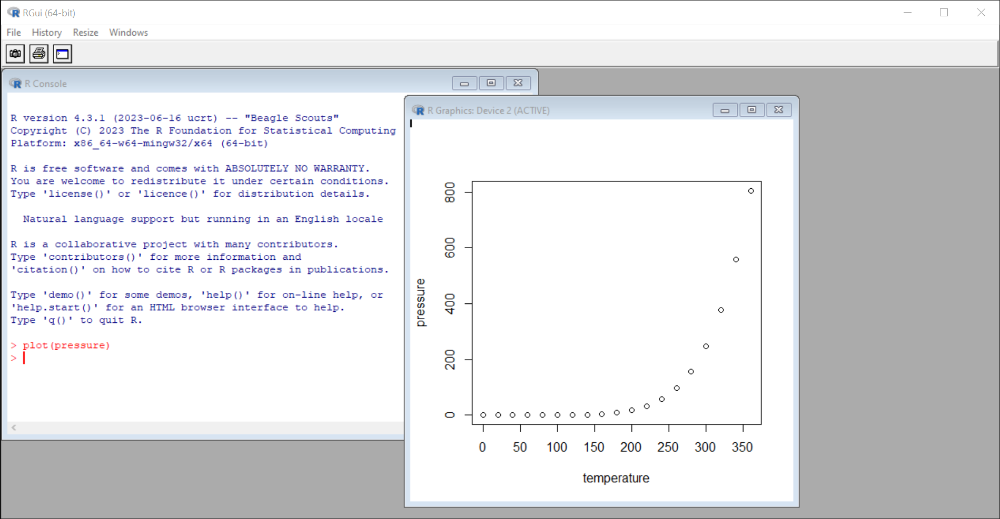
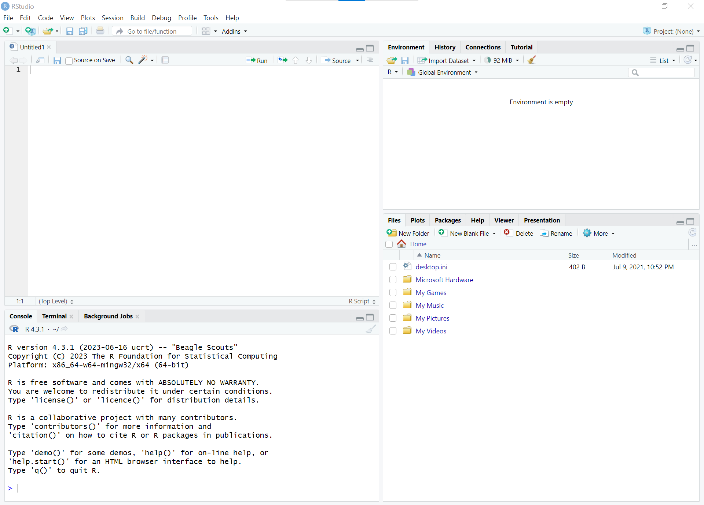

```{r setup, include=FALSE}
## https://yihui.org/knitr/options/
knitr::opts_chunk$set(echo = TRUE, comment='')
options(width = 60)  # to fit output on slides: either smaller font or shorter width (or both)
try( remove.packages('car') )  # to trigger appropriate error messages in the demo.
```


## Debugging
\small

`\baselineskip`: $\the\baselineskip$  \hfill
`\lineskip`: $\the\lineskip$  
`\parskip`: $\the\parskip$  \hfill
`\parsep`: $\the\parsep$  
`\itemsep`: $\the\itemsep$  \hfill
`\topsep`: $\the\topsep$  
`\partopsep`: $\the\partopsep$  \hfill
`\OuterFrameSep`: $\the\OuterFrameSep$  

:::::: {.columns align="c"}
::: {.column width="50%"}

`\baselineskip`: $\the\baselineskip$  
`\parskip`: $\the\parskip$  
`\parsep`: $\the\parsep$  
`\itemsep`: $\the\itemsep$  
`\topsep`: $\the\topsep$  
`\partopsep`: $\the\partopsep$  
`\OuterFrameSep`: $\the\OuterFrameSep$

:::
::: {.column width="50%"}

\begin{Shaded}
baselineskip: \the\baselineskip  \\
parskip: \the\parskip  \\
parsep: \the\parsep  \\
itemsep: \the\itemsep  \\
topsep: \the\topsep \\
partopsep: \the\partopsep \\
OuterFrameSep: \the\OuterFrameSep \\
\end{Shaded}

:::
::::::

```{r debugging, echo=FALSE}
message("pandoc version: ", rmarkdown::pandoc_version())
message("knitr version: ", packageVersion("knitr"),
        "\nrmarkdown version: ", packageVersion("rmarkdown")
        )
```


## Prerequisites

- Access to a copy of the [$\Rlogo$](https://www.r-project.org)[^Rlogo] software

  - i.e., a "binary executable"
  
  - Go to _[www.r-project.org](https://www.r-project.org)_ to get a copy,  
    or ask your system administrator.

- Knowledge of common mathematical operations: arithmetic, logarithms, etc.

- No previous experience with R or programming required.


# Welcome

## Pop Quiz

\annote{\fade{We will review these \textit{at the end}, so you can see how much you have learned.}}

+ What does 'CRAN' stand for?
+ Why is it named '$\R$'?
+ How can you use $\R$ _interactively_?
+ How do you find out what a function does & how to use it?
+ How do you store values to re-use later?
+ True or False: Warnings can be ignored, but an Error means I made a mistake.
+ True or False: Error messages will tell me how to fix the problem.

```{r welcome, echo=FALSE, results='asis'}
if (params$is_virtual) {
  cat("\\ 
  \n### Answer in the chat:
  \n
  \nWhat emoji best describes your current mood or state of mind?
  ")
}
```


## Introductions

- Name
- Pronouns
- Job title, role
- _optional_: a hobby or activity you enjoy?

<!-- -->

- Have you used $\R$ before?
- Have you used a programming language before?

::: notes

Other icebreaker questions:

- Favourite candy or treat as a child?
- Favourite music band or genre?
- Favourite book?
- Highlight of the past month / year (personal or professional)?

If available on platform, online polls:

- Where are you joining from?
- Have you used `R` before?
- Have you used a programming language before?

If a chat is available, put answer to a question there:

- What emoji best describes your current mood or state of mind?
- Favourite emoji?

More icebreaker ideas:

- https://blog.slido.com/virtual-icebreakers/
- https://www.mural.co/blog/virtual-meeting-ice-breakers

:::


## <!-- interactive --> Icebreaker activity

:::::: {.columns .onlytextwidth}
::: {.column width="48%"}

**What is this?**  
  1--3 word description, for\ example:
  
  - "This is grey"
  - "This looks uncomfortable"
  
**OR** caption this image?

<!-- empty line for spacing -->\
On your turn:

1. Previous person's name
2. Their answer to the question

3. Your name
4. Your answer

5. Name of the person to go next

:::
::: {.column width="50%"}

![Caption this image<!-- of a pigeon with a leaf on its face -->.\
©\ [John\ Speirs/\linebreak[0]Comedywildlifephoto.com](https://www.comedywildlifephoto.com/gallery/comedy-wildlife-2021-competition-winners.php)](images/john-speirs_i-guess-summers-over.jpg){width=100%}

:::
::::::


## Learning Objectives

* Get familiar with the , "html", "logo.jpg")`){height=1em} *interface*
* Use technical _terms_ for $\R$ concepts
* Enter *commands*
  * use $\R$ interactively: understand input & output
  * use some common *functions*
* Get familiar with '$\R$ objects'
  * store & retrieve values
* Understand *Errors*, *Warnings*, and *Messages*
* How to get Help


## Why is it named '$\R$'?

1. **$\R$** started as an _open-source_ implementation of the  
   **`S`** statistical computing language (S-PLUS)^[https://www.r-project.org/about.html]
  
   - `S` was created at Bell Laboratories in 1976^[https://en.wikipedia.org/wiki/S_(programming_language)]
   
   - $\R$ was based on the `S` syntax (mostly v3), but works very differently "under the hood".
  
2. **$\R$** was created by [**R**]{.underline}oss Ihaka and [**R**]{.underline}obert Gentleman 
   --- aka "R & R"^[https://www.r-project.org/contributors.html] --- 
   at the University of Aukland in the early 1990s.

\bigskip
_Read more about the history of $\R$  on [Wikipedia](https://en.wikipedia.org/wiki/R_(programming_language)#History)_^[https://en.wikipedia.org/wiki/R_(programming_language)#History]


# Interacting with $\R$ (Interface)

## The $\Rlogo$ Interface

- 'base $\R$' has a slightly different interface for each **O**perating **S**ystem (OS)
  - GUI = **G**raphical **U**ser **I**nterface
- $\R$ can also run inside of a terminal (no GUI) or other software (different GUI).

### [**I**ntegrated **D**evelopment **E**nvironment](https://en.wikipedia.org/wiki/Integrated_development_environment) (IDE)

- An IDE is like an extra interface layer on top of 'base $\R$'
- IDEs often add convenient tools to make writing code easier (e.g., syntax highlighting),
  and for developing larger projects with multiple files.
- **[RStudio](https://posit.co/products/open-source/rstudio/)** is one of the most popular cross-platform IDEs for $\R$.
  - RStudio is available in open source (free/libre) and commercial^[for organizations not able to use software licensed with AGPL] editions.
  

## A quick tour of the 'base $\R$ GUI'

<!-- {width=90%} -->
\begin{figure}
\centering
\begin{tikzpicture}[overlay/.style={ultra thick, rounded corners, draw=red, fill=white, fill opacity=0.5, text opacity=1},
                    note/.style={align=center, font=\Large\bfseries}]
  \node[anchor=south west,inner sep=0] (image) at (0,0) {\includegraphics[width=0.9\textwidth]{images/R-screenshot-script-plot-win.png}};
  \begin{scope}[x={(image.south east)},y={(image.north west)}]
    \draw[overlay] (0,0.15) rectangle (0.54,0.87);
    \node[note] at (0.14,0.27) {console};
    \draw[overlay] (0.245,0.065) rectangle (0.585,0.76);
    \node[note] at (0.415,0.41) {source};
    \draw[overlay] (0.588,0.07) rectangle (0.987,0.87);
    \node[note] at (0.788,0.47) {plot\\ window};
  \end{scope}
\end{tikzpicture}
\caption{Screenshot of the R GUI in Windows.}
\end{figure}


## A quick tour of RStudio

<!-- RStudio is pretty strict about the use of its logo: https://www.rstudio.com/about/logos/ -->

:::::: {.columns .onlytextwidth}
::: {.column width="73%"}

The RStudio GUI has 4 'panes' that contain 'tabs'. 

<!-- {width=90%} -->
<!-- LaTex code to add graphical annotations with the Tikz package.
But the slide should still be comprehensible with just the image, above.
I could add a condition that only includes this for pdf output, 
and a simple Markdown image link (as above) for other formats.
-->
\begin{figure}
\centering
\begin{tikzpicture}[overlay/.style={ultra thick, draw=red, fill=white, fill opacity=0.5, text opacity=1},
                    circler/.style={radius=3ex},
                    note/.style={align=center, font=\Large\bfseries}]
  \node[anchor=south west,inner sep=0] (image) at (0,0) {\includegraphics[width=\textwidth]{images/RStudio-screenshot-4pane-default.png}};
  \begin{scope}[x={(image.south east)},y={(image.north west)}]
    \draw[overlay] (0.45,0.7) circle[circler] node[note] {1};
    \draw[overlay] (0.45,0.2) circle[radius=3ex] node[note] {2};
    \draw[overlay] (0.80,0.7) circle[radius=3ex] node[note] {3};
    \draw[overlay] (0.80,0.2) circle[radius=3ex] node[note] {4};
  \end{scope}
\end{tikzpicture}
\caption{Screenshot of RStudio (default layout).}
\end{figure}

:::
::: {.column width="25%"}

left:

  1. top: **Source**^[empty until you create or open a file]

  2. bottom: **Console, Terminal, ...**


right:

  3. top:  
     **Environment, History, ...**
  
  4. bottom: 
     **Files, Plots, Help, ...**


:::
::::::


## Interacting with $\Rlogo$

- Regardless of the GUI, 
  you interact with $\R$ primarily using a _command\ line_
  
  - aka a [c]{.underline}ommand [l]{.underline}ine [i]{.underline}nterface (cli)
  - the command line is usually in the *console*

- “Question-and-Answer Model”

  - | You ask $\R$ to do something (a *command*),  
    |      and $\R$ tells you the answer (*result*).
    
- Instructions are given to $\R$ using the *R language*.

::: notes
R is designed so that users can start by using it *interactively* (what we will do today), and then gradually use it for more programming as their needs and skills grow.

  - Not "point-and-click": no menus or wizards to guide you through steps of an analysis or procedure.
:::

  
## The $\Rlogo$ console

The *console* is a window or pane where you will find:

- The _command line_

  - where you will enter commands for $\R$ to run

- Results of commands and other output

- `Messages`, \WarningTok{Warnings}, and \ErrorTok{Errors} 


## The $\Rlogo$ command-line {.squeeze}

- The command *prompt* normally looks like this^[\fade{the colour of the prompt varies depending on the interface}]:

  ``` default
  >
  ```
  
  - This is $\R$'s way of saying "I am ready to accept new commands".
  - Type a new command on the line after this prompt (i.e., *input*).
  
- **Press \important{\texttt{return}}/\important{\texttt{enter}} to *run* the current *command* **

- If you can still edit the command next to the prompt, then it has not been submitted to $\R$ to execute (it is still waiting for input).

- If the last prompt is not empty (i.e., there is text beside it)  
  _and_ you cannot edit what is beside the prompt,  
  it means $\R$ is still running the last command and is not ready to accept a new command yet.
  - Wait for a new empty prompt to appear before entering the next command.


## The $\Rlogo$ command-line (continued) {.squeeze}

- If the prompt looks like this:  

  ``` default
  +
  ```

  it means the last command was _incomplete_ and $\R$ is waiting for more input.  
  $\R$ will not do anything until the command is completed or cancelled.
  
  - This usually means you forgot a closing\
    *quote* \important{\texttt{"}}, *parenthesis* \important{\texttt{(}}, 
    *bracket* \important{\texttt{[}}, or *brace* \important{\texttt{\{}}
    
- \highlight{You can \textit{cancel} the current command at any time by pressing \texttt{escape}} (\important{\texttt{esc}})


# Warming up: some early commands

## Input & Output

In this presentation, 

+ *commands* that can be entered in the *command-line* look like this:

  ``` default{#format_input}
  Input (commands)
  ```

  - You can try these yourself!

+ Expected output (results) look like this:

  ```{r format_output, include=TRUE, eval=TRUE, echo=FALSE}
  cat("Output (results)")
  ```


## $\Rlogo$ offers suggestions

Read the opening message carefully.

<!-- {width=90%} -->
\begin{figure}
\centering
\begin{tikzpicture}[overlay/.style={ultra thick, rounded corners, draw=red, fill=none},
                    note/.style={anchor=west, align=left, font=\Large\bfseries},
                    ->/.style={ultra thick, red, -{Latex}[round]}]
  \node[anchor=south west,inner sep=0] (image) at (0,0) {\includegraphics[width=0.9\textwidth]{images/R-screenshot-win-default}};
  \begin{scope}[x={(image.south east)},y={(image.north west)}]
    \node (rect) [overlay, fit={(0,0.36) (0.42,0.46)}, inner sep=0] {};
    \node (note)  [note, text width=12em] at (0.55,0.41) {\textcolor[rgb]{0.60,0.00,0.00}{$\R$ offers suggestions to start with}};
    \draw [->] (note.west) -> (rect.east);
  \end{scope}
\end{tikzpicture}
\caption{$\R$ offers suggestions of commands to \KeywordTok{\texttt{Type}} in the console when it starts.}
\end{figure}


## $\Rlogo$ is a show-off

+--------------------+----------------------------------------------------------+
| ``` r              |                                                          |
| demo(graphics)     | - some plots and graphs that can be made with $\R$       |
| ```                |                                                          |
+--------------------+----------------------------------------------------------+
| ``` r              |                                                          |
| demo(image)        | - image-like graphics and maps                           |
| ```                |   that can be produced with $\R$                         |
+--------------------+----------------------------------------------------------+
| ``` r              |                                                          |
| demo(lm.glm)       | - a demonstration of linear modelling & GLMs             |
| ```                |                                                          |
+--------------------+----------------------------------------------------------+
| ``` r              |                                                          |
| demo()             | - a list of available demos                              |
| ```                |                                                          |
+--------------------+----------------------------------------------------------+
| ``` r              | \ctop{}                                                  |
| help.start()       | | **&larr;** A great place to start,                     |
| ```                | |     especially if you are comfortable reading          |
|                    | |     documentation for a programming language.          |
|                    | |     _More on this later._                              |
|                    |                                                          |
+--------------------+----------------------------------------------------------+

### Note

\R{} will not only show the output, but also _the code used to produce it_.

<!--
The descriptions in this section could be entered as comments directly in the code blocks.
But the comment character hasn't been introduced yet,
and I need a clear way to explain the commands in the meantime.
-->


## $\Rlogo$ is a calculator

:::::: {.columns .onlytextwidth}
::: {.column width="45%"}

```{r calculator}
1 + 1
2 * 2
2 ^ 3
```

:::
::: {.column width="45%"}

```{r calculator2}
10 - 1
8 / 2
sqrt(9)
```

:::
::::::

- These are *expressions*
- *Expressions* are *evaluated*, and the *value* (result) is *returned* 
  (sometimes\ *invisibly*)

::: notes

The bullet points are accurate, but I note that the 
[R Language Definition](https://cran.r-project.org/doc/manuals/r-release/R-lang.html)
distinguishes between 'expressions', which are actually a type of object,
and 'statements' (see s2.1.3 'Language objects', s2.1.4 'Expression objects'):

- An *expression* \[object?\] contains one or more statements.
- A statement is a syntactically correct collection of tokens.
- Expression objects are special language objects which contain parsed but unevaluated R statements. 
- "an expression object can contain several such expressions" (not clear)

Therefore, my understanding is that 
a *statement* is parsed (by the R parser),
which results in an unevaluated *expression* (an object of mode "expression"),
which can in turn be evaluated (by 'the evaluator', such as `eval()`)
to return the *value*.

"All expressions have a value." (s3 'Evaluation of expressions')

:::


## $\Rlogo$ command-line tips

- With the cursor next to the empty prompt (\OtherTok{\texttt{>}}),  
  use the up & down \important{arrow keys} (&uarr;&darr;) 
  to re-produce previous commands.
  
- This lets you “scroll through your *command history*”.
  
- Press \important{up} (\important{$\uparrow$}) once, and you get the last command you entered  
  without having to copy & paste.


# Simple $\R$ objects

## Vectors

- The most basic kind of *object* in $\R$ is a *vector*

- Think of a vector as a list of related values (data),  
  which are _all the same type_
  
- A single value is an "*atomic vector*" (a vector with a length of 1)

<!-- empty paragraph for space -->\

:::::: {.columns align=center}
::: {.column width="25%"}
\centering
\important{\Large\textbf{\tikzmarknode{index}{\textit{index}:}\\ the item\\ number}}
:::
::: {.column width="50%"}

\hfill\tikzmarknode[anchor=south east, inner sep=0]{code_tr}{}
```{r vector_demo, echo=4}
.opts.width <- getOption('width')
options(width = 30)
2
1:10
options(width = .opts.width)
```
\tikzmarknode[anchor=north west, inner sep=0]{code_bl}{}\vspace{-\baselineskip}

:::
::: {.column width="25%"}
\centering
\important{\Large\textbf{\tikzmarknode{value}{\textit{value}}}}
:::
::::::

\begin{tikzpicture}[remember picture, overlay, 
                    arr/.style={ultra thick, red, -{Latex}[round]}]
  \node[anchor=south west,inner sep=0, fit={(code_bl)(code_tr)}] (code) {};
  \begin{scope}[shift=(code.south west),x=(code.south east),y=(code.north west)]
    \draw let \p1 = (index.east) in 
      [arr] (index.east) -- (-0.5cm,\y1) -- (-0.5cm,0.88) -> (-0.01,0.88);
    \draw let \p1 = (index.east) in 
      [arr] (index.east) -- (-0.5cm,\y1) -- (-0.5cm,0.37) -> (0.02,0.37);
    \draw let \p1 = (value.west) in 
      [arr] (value.west) -- (0.25,\y1) -- (0.25,0.87) -> (0.18,0.87);
    \draw let \p1 = (value.west) in 
      [arr] (value.west) -- (0.25,\y1) -- (0.21,0.44);
  \end{scope}
\end{tikzpicture}


## Using vectors

- Vectors can be used in calculations

- Operations are applied to each item
  (*element-wise*)
  
  ```{r vectors_1, results='hide'}
  sum( c(1, 2, 3, 4, 5) )
  1:10 + 2
  1:5 * 5:1
  ```
- Vectors can be used to plot data in a graph

  ```{r vectors_2, results='hide', fig.keep='none'}
  plot( rnorm(1000) )
  hist( rnorm(1000) )
  ```
  
<!-- 1,000 random numbers from a normal distribution -->


## Some data *types* (of *atomic vectors*)

:::::: {.columns align=center}
::: {.column width="45%"}

### ***numeric***

* Includes *integers*, *real* (decimal / *double*), and *complex* numbers.
* `1.23`{.r}

### ***character*** (*string*)

* in single `'`{.r} or double `"`{.r} quotes. 
* `'hello world'`{.r}
* `"1.23"`{.r}

### ***logical***

- `TRUE`{.r} or `FALSE`{.r}

:::
::: {.column width="45%"}
\hfill\tikzmarknode[anchor=south east, inner sep=0]{code_tr}{}
\vspace{-\baselineskip}
```{r data_types, results='hide'}
class(1.23)
class('hello')
class("1.23")
class(FALSE)

typeof(1.23)
typeof(1:10)

as.character(c(1,2,NA,4))
```
\vspace{-\baselineskip}\tikzmarknode[anchor=north west, inner sep=0]{code_bl}{}
\bigskip

\tikzmarknode{as}{}`as.*()`{.r}: converting from one type to another = *coercion*

:::
::::::

\begin{tikzpicture}[remember picture, overlay, 
                    arr/.style={ultra thick, gray, -{Latex}[round]}]
  \node[anchor=south west,inner sep=0, fit={(code_bl)(code_tr)}] (code) {};
  \begin{scope}[shift=(code.south west),x=(code.south east),y=(code.north west)]
    \draw let \p1 = (as.north) in 
      [arr] ($ (as.north) +(1ex,1.5ex) $) -- ($ (\x1,0) +(1ex,\ShadedFrameSep+0.5ex) $);
  \end{scope}
\end{tikzpicture}


# Storing & retrieving values

## Symbolic _variables_
<!-- variables vs objects?  Objects vs names?  
In R, everything is an _object_, and each has a name -->

- You can store values (*objects*) in symbolic variables (*names*) 
  using an *assignment operator*:
  
-------- ------------------------------------------------------------------
`<-`{.r} assign the *value* on the **right** to the *name* on the **left**
---------------------------------------------------------------------------

:::::: {.columns .onlytextwidth}
::: {.column width="48%"}

- Names can include:

|||<!-- empty header row, because most Markdown parsers require a header row -->
|:----------|---------|
|letters    |\StringTok{\texttt{a-z A-Z}}|
|numbers    |\StringTok{\texttt{0-9}}    |
|periods    |\StringTok{\texttt{.}}      |
|underscores|\StringTok{\texttt{\_}}     |

- Names _should begin with a **\StringTok{letter}**_.

:::
::: {.column width="48%"}
```{r assignment, results='hide'}
A <- 10
B <- 10 * 10
A_log <- log(A)
B.seq <- 1:B

assign('x', 3)
```
:::
::::::


## Retrieve values

When a variable *name* is evaluated, it returns the stored *value*. 

:::::: {.columns .onlytextwidth}
::: {.column width="45%"}

```{r}
A
A_log
```

:::
::: {.column width="45%"}

```{r}
B
x
```

:::
::::::

```{r}
B.seq
```


## Built-in variables

Some words and letters already have values in $\R$  
and should **never be used as variable names**.

:::::: {.columns .onlytextwidth}
::: {.column width="45%"}

```{r}
pi
```

:::
::: {.column width="45%"}

```{r, eval=FALSE}
version
```
```{r, echo=FALSE}
cat("... information about \nthis version of R ...")
```

:::
::::::

```{r}
letters
LETTERS
```


## Reserved words

Some words and letters already have special meaning in the R language (*keywords*) 
and should **never be used as variable names**.

\small
\begin{tikzpicture}[remember picture, overlay]
    \draw[draw=none, fill=lightgray, fill opacity = 0.2] 
      ($ (pic cs:tl) +(0,\baselineskip) $) rectangle ($ (pic cs:br) +(0,-0.2\baselineskip) $);
\end{tikzpicture}

--------------------  ---------------------  --------------------------------------------------------
\tikzmarknode{tl}{}                          <!-- R will trigger an Error if you try to use these: -->
  `NA`{.r}            "Not Available"        placeholder for unknown or missing values

\ `NaN`{.r}           "Not a Number"         placeholder for *undefined* numeric values

\ `NULL`{.r}          _a special object_     placeholder for missing *objects*

\ `Inf`{.r}           Infiniti

\ `TRUE`{.r}          Logical value

\ `FALSE`{.r}         Logical value          \hfill\tikzmarknode{br}{}

<!-- -->                                     <!-- These _can_ be used, but it's not a good idea: -->
\ `T`{.r}             short for `TRUE`{.r}   

\ `F`{.r}             short for `FALSE`{.r}

\ `c,q,t,C,D,I`{.r}   $\R$ functions

\ `diff, df, pt`{.r}  $\R$ functions
-----------------------------------------------------------------------------------------------------

\normalfont


## $\Rlogo$ is case-sensitive

+----------------+----------------+----------------+:--------------:+
| ``` r          | \ctop{}        | ``` r          |                |
| R.version      | a variable     | pi             |                |
| ```            |                | ```            |                |
+----------------+----------------+----------------+----------------+
| ``` r          | \ctop{}        | \ctop{}        | \ctop{}        |
| R.Version()    | a *function*   | \AlertTok{%    |                |
| ```            |                | \textit{PI}}   |                |
+----------------+----------------+----------------+----------------+
| ``` r          | \ctop{}        | ``` r          |                |
| letters        | a-z            | NA             |                |
| ```            |                | ```            |                |
+----------------+----------------+----------------+----------------+
| ``` r          | \ctop{}        | \ctop{}        | \ctop{}        |
| LETTERS        | A-Z            | \AlertTok{%    |                |
| ```            |                | \textit{na}}   |                |
+----------------+----------------+----------------+----------------+


## Use variables in calculations

:::::: {.columns .onlytextwidth}
::: {.column width="45%"}
```{r}
A +5
```
:::
::: {.column width="45%"}
```{r}
B/A
```
:::
::::::

```{r calc_var, fig.keep='none'}
Weight <- c(60 , 72 , 57 , 90 , 95 , 72 )
Height <- c(1.7, 1.8, 1.6, 1.9, 1.7, 1.9)
BMI <- Weight / Height^2
BMI
plot(Height, Weight)
```


## Housekeeping

+--------------------+--------------------------------------------+
| ``` r              | \ctop{}                                    |
| ls()               | List all variables you have created        |
| ```                |                                            |
+--------------------+--------------------------------------------+
| ``` r              | \ctop{}                                    |
| rm(x)              | Remove the variable ‘\name{x}’ from memory |
| ```                |                                            |
+--------------------+--------------------------------------------+
| ``` r              | \ctop{}                                    |
| rm(list=ls())      | Remove _all variables_ from memory\        |
| ```                | (clear memory)                             |
+--------------------+--------------------------------------------+

```{r, echo=FALSE}
## run this command, which is in a non-executable block in the table.
rm(list=ls())
```
```{r bad_pie, results='hide'}
pi
pi <- "pie"
pi
rm(pi)
pi
```


# Operators

## Operators

*Operators* are special symbols that go between two values, to perform an
*operation* on both values (the *operands*) and return the *result*.

- For example: `2 * 3`{.r} is a way of saying "*multiply* 2 and 3 together"
- Operations are evaluated one pair at a time, according to precedence (*order of operations*).

:::::: {.columns .onlytextwidth}
::: {.column width="48%"}

### Arithmetic Operators
The usual math symbols: `+, -, *, /, ^`{.r}, etc. 

### Comparison (*Relational*) Operators
For comparing two values: `==, !=, >, <`{.r}, etc.

:::
::: {.column width="48%"}

### Assignment Operators
Assign values to symbolic variables: `<-, ->, =`{.r}, etc.

### Boolean Operators
Combining logical values (`TRUE, FALSE`{.r}): `!, &, |`{.r}, etc.

:::
::::::


## Comparisons

Comparison of 2 values results in
*logical values*: `TRUE`{.r}\ or\ `FALSE`{.r}

----      ----------------------------------------------------
`==`{.r}  "equal"  ---  
          \important{Note the \textbf{two} equals signs.}  \
          Not to be confused with a single equals sign\
          \ (used to *assign* values). 
          
`!=`{.r}  "not equal"

`>`{.r}   "greater than"

`<`{.r}   "less than"

`>=`{.r}  "greater than or equal to"

`<=`{.r}  "less than or equal to"
--------------------------------------------------------------


## Comparisons: examples

:::::: {.columns .onlytextwidth}
::: {.column width="45%"}

```{r comparisons1}
1 == 2
1 <= 2
1 < "a"
```

:::
::: {.column width="45%"}

```{r comparisons2}
1 < 2
1 != "foo"
0 == FALSE
```

:::
::::::


## Comparing decimals ('floating point' arithmetic) {.squeeze}

Computers can't represent _all_ values accurately, and there is often some rounding that occurs (even at 50+ decimal places).  
As a result, 'floating point' values may not be _reliably equal_.
^[R FAQ: "[Why doesn’t R think these numbers are equal?](https://cran.r-project.org/doc/FAQ/R-FAQ.html#Why-doesn_0027t-R-think-these-numbers-are-equal_003f)"]
<!-- this footnote really belongs with the solutions, below, but putting it there would put it at the bottom of the _column_, and I want it at the bottom of the *page* -->
^[See Stackoverflow: "[Why are these numbers not equal?](https://stackoverflow.com/questions/9508518/why-are-these-numbers-not-equal)" for other solutions]

:::::: {.columns .onlytextwidth align=top}
::: {.column width="45%"}
\ctop{}
This is a common source of confusion, but it is a fact of how computers handle floating point arithmetic, and not specific to $\R$.
:::
::: {.column width="48%"}
\chup{}
<!-- Simpler example (with longer lines): .3 + .6 == .9 -->
```{r comparing_decimals}
a <- sqrt(2)
a * a == 2  # should be TRUE
a * a - 2
```
:::
::::::

:::::: {.columns .onlytextwidth}
::: {.column width="48%"}
Two common solutions:

1. `round()`{.r} decimal values when comparing them
2. use a function with a tolerance for small differences, such as `all.equal()`{.r}

:::
::: {.column width="48%"}
```{r comparing_round}
round(a * a, 8) == 2  #(1)
all.equal(a * a, 2)   #(2)
```
:::
::::::


# Functions

## Functions

- *Functions* are special commands that can do more than simple operators[^operators_are_functions].
- They are the main instructions you give to R.
- To use (or *call*) a function, the command must be structured properly, following the "grammar rules" of the $\R$ language (*syntax*).

<!-- code example to check formatting
``` r
log( 8 , base = 2 )
```
-->

```{=latex}
% https://tex.stackexchange.com/questions/136143/tikz-animated-figure-in-beamer
\begin{figure}
\centering\large\ttfamily
\vspace{2\baselineskip}

\begin{shaded}

\tikzmarknode[anchor=east]{fun}{\FunctionTok{log}}%
\tikzmarknode{popen}{(}
  \tikzmarknode[anchor=west]{arg1}{\DecValTok{8}}
  \tikzmarknode{comma}{,}
  \tikzmarknode{arg2}{\AttributeTok{base =} \DecValTok{2}}
\tikzmarknode{pclose}{)}
\end{shaded}

\caption*{}
\label{fig:function}
\end{figure}

\pause
\begin{tikzpicture}[remember picture, overlay,
                    note/.style={font=\Large\itshape},
                    frame1/.style={ultra thick, draw=red, fill=none, fill opacity=0.1, minimum height=2\baselineskip, inner sep=2pt},
                    frame2/.style={ultra thick, draw=blue, fill=lightgray, fill opacity=0.5, minimum height=2\baselineskip, inner sep=1pt},
                    link1/.style={very thick},
                    link2/.style={thick}]
  \node (note_fun)     [visible on=<2->, note, anchor=east, align=right, left=2ex of fun.west] {function name};
  \node (frame_fun)    [visible on=<2->, frame1, fit=(fun)] at ($ (fun) +(-2pt,0.1pt) $) {};
  \pause
  \node (frame_popen)  [visible on=<3->, frame2, fit=(popen)] at ($ (popen) +(1.4pt,-1.25pt) $) {};
  \node (frame_pclose) [visible on=<3->, frame2, fit=(pclose)] at ($ (pclose) +(-1.25pt,-1.25pt) $) {};
  \node (frame_arg1)   [visible on=<5->, frame1, fit=(arg1)] at ($ (arg1) +(0pt,-1.25pt) $) {};
  \node (frame_arg2)   [visible on=<5->, frame1, fit=(arg2)] at ($ (arg2) +(0pt,-1.25pt) $) {};
  \node (frame_args)   [visible on=<4->, frame1, fit=(frame_arg1)(frame_arg2), inner sep=0.8pt] {};
  \node (note_parens)  [visible on=<3->, note, above=2ex of frame_args] {parentheses};
  \draw [visible on=<3->, link1] (note_parens.south) -- (frame_popen.north);
  \draw [visible on=<3->, link1] (note_parens.south) -- (frame_pclose.north);
  \pause
  \node (note_args)    [visible on=<4->, note, anchor=west, align=left, below right=-1ex and 3ex of frame_args.south east] {arguments};
  \draw [visible on=<4->, ultra thick, draw=red] (note_args.west) -- (frame_args.south east);
  \pause
  \node (frame_comma)  [visible on=<5->, frame2, fit=(comma)] at ($ (comma) +(0,2.65pt) $) {};
  \node (note_comma)   [visible on=<5->, note, below=4ex of frame_comma.south] {comma};
  \node (note_arg1)    [visible on=<5->, note, anchor=east, align=right, below left=2ex and 3ex of frame_arg1.south] {argument 1};
  \node (note_arg2)    [visible on=<5->, note, anchor=west, align=left, below right=2ex and 0pt of frame_arg2.south] {argument 2};
  \draw [visible on=<5->, link1] (note_arg1.east) -- (frame_arg1.south);
  \draw [visible on=<5->, link1] (note_arg2.west) -- (frame_arg2.south);
  \draw [visible on=<5->, link1] (note_comma.north) -- (frame_comma.south);
\end{tikzpicture}

```


[^operators_are_functions]: technically, operators are special functions with exactly 1 (*unary*) or 2 (*binary*) *arguments*.  See section 3.1.4 "[Operators](https://cran.r-project.org/doc/manuals/r-release/R-lang.html#Operators)" in the [R Language Definition](https://cran.r-project.org/doc/manuals/r-release/R-lang.html).


## Function arguments

<!-- update: clarify default values -->

- *arguments* are the values passed to a function when it is *called*

  - these are values the function needs to do its thing
  - some change _how_ the function operates (these are usually optional)
  <!-- because they have a default value -->

- arguments are separated by a comma (`,`{.r})

- arguments can be *passed by order* or *passed by name*

  - *passed by order* means the arguments are specified in the correct order, without a name

  - *passed by name* means the arguments can be in any order, but must be declared by name: `argument = value`{.r}
    
### !

Note the **single** equals sign (`=`{.r}),
used to assign values to function arguments by name


## Calling Functions

- Some functions can be called without arguments.
- \textbf{You still need the parentheses\important{()} !}
- The same word without \important{\texttt{()}} refers to an *object* (*variable*):  
  adding the \important{\texttt{()}} specifies a *function call*
- Typing a function name without brackets usually outputs the _raw code_ for that function
  (unless another object has been defined with the same name).
  - i.e., the *value* of the function object itself.

:::::: {.columns .onlytextwidth}
::: {.column width="48%"}
```{r function_call, echo=3}
.opts.width <- getOption('width')
options(width = 30)
ls()
```
:::
::: {.column width="48%"}
```{r function_not_call, echo=1}
ls
options(width = .opts.width)
```
:::
::::::

## A complex example

```{r complex_expr_fun, results='hide'}
Var <- sum( ((x <- 1:20) - mean(x))^2 / (length(x) -1) )
```
+ Try breaking this up and run each piece one at a time to see all the steps.

\pause
+ The shorter version:
```{r complex_simple_fun}
var(1:20)
```


# Errors, Warnings, and Messages

## Errors

- When R receives a command it does not understand, or cannot execute, it outputs an ***error*** to the *console*.
  - This is a message that begins with the word "\ErrorTok{\texttt{Error}}".
  
- A command that produces an *error* is **not** executed.
  <!-- - neither are any commands after the error. -->

```{r errors1_code, eval=FALSE, echo=TRUE}
Fail <- 1 + "2"
```
```{r errors1_out, eval=TRUE, echo=FALSE}
try( Fail <- 1 + "2" )
```
```{r errors2_code, eval=FALSE, echo=TRUE}
Fail
```
```{r errors2_out, eval=TRUE, echo=FALSE}
try( Fail )
```

- Error messages tell you what went wrong, not how to fix it:  
  that's up to you to figure out.
- When an error occurs, **$\R$ stops running** commands and returns to the command-line.
  - Your *session* is still active: $\R$ didn't quit, and you can enter more commands.


## Warnings

- Some commands still work, but did not run exactly as $\R$ (or the developers) think is "ideal", and may produce a ***warning*** instead.
  - This is a message that begins with the word "\WarningTok{\texttt{Warning}}".
  
- These do not interrupt what R is doing: it will keep running, but tell you that there were warnings. 
  - _It is up to you to review the warnings and decide if they are important_.
  - Use the `warnings()`{.r} command to review them.
  
```{r warnings}
oops <- log(-1)
```


##  Errors, Warnings, and Messages

+ ***Errors*** indicate something is wrong, and $\R$ had to stop.  You'll have to figure out what caused the error, fix it, and try again.

  + \textcolor[rgb]{0.8,0,0}{Think of errors as a red traffic light: stop --- something is wrong!
}

+ ***Warnings*** indicate something unusual happened, but $\R$ is able to continue.  You'll have to assess if it's worth worrying about.

  + \textcolor[rgb]{0.9,0.7,0}{Think of warnings as a yellow traffic light: you can go, but be careful and pay attention, in case there is a problem.
}

+ Other ***Messages*** are for information, and a sign that things are working fine (at least, according to the programmers who created the function).

  + \textcolor[rgb]{0,0.6,0}{Think of messages as a green traffic light: you are safe to continue.}

::: notes
Credit to Chester Ismay & Albert Kim for the traffic light analogy:
https://moderndive.netlify.app/1-getting-started.html
:::


# Help & documentation

## HELP

+ [R *documentation*](#textttr-documentation) (help files) 

+ [Books](#help-books)

+ [Web sites](#help-web-sites)

+ [Cheat sheets / Reference cards](#help-reference-cards-cheat-sheets)

+ Each Other


## HELP: Books

+ Springer publishing: "**[Use R!](https://www.springer.com/series/6991)**" series
  - Some older: [A Beginner's Guide to R](https://link.springer.com/book/10.1007/978-0-387-93837-0) (2009)
  - Some more recent: [Data Wrangling with R](https://link.springer.com/book/10.1007/978-3-319-45599-0) (2016)
  - Some focus on specific methods, e.g.: 
    - [Numerical Ecology with R](https://link.springer.com/book/10.1007/978-3-319-71404-2) (2018)
    - [Applied Spatial Data Analysis with R](https://link.springer.com/book/10.1007/978-1-4614-7618-4) (2013)
    
+ Other suggestions on the R web site: [www.r-project.org/doc/bib/R-books.html](https://www.r-project.org/doc/bib/R-books.html)

- R packages can change quickly: be careful if older content refers to old versions of packages, or packages that are deprecated.  
  - Concepts or general methods may still be relevant.
  
+ Many are available in physical or digital formats (or both)

<!-- 


-->


## HELP: Web Sites

- R web site: [www.r-project.org](http://www.r-project.org)
  - especially the "Documentation" section
  - [e-mail lists](https://www.r-project.org/mail.html)
- [RStudio Education](https://education.rstudio.com/): [education.rstudio.com](https://education.rstudio.com/)
- R-bloggers.com [www.r-cookbok.com](http://www.r-cookbok.com)
- [Stack Overflow](https://stackoverflow.com/questions/tagged/r) ([stackoverflow.com](https://stackoverflow.com/questions/tagged/r))
  - Q&A site: search for your question, or ask your own
- [Cookbook for R](http://www.cookbook-r.com/) ([www.cookbook-r.com](http://www.cookbook-r.com/))

- Your preferred search engine ...


## HELP: Reference cards / cheat sheets

- https://cran.r-project.org/doc/contrib/Short-refcard.pdf 
- https://cran.r-project.org/doc/contrib/refcard.pdf
- [RStudio IDE cheat sheet](https://raw.githubusercontent.com/rstudio/cheatsheets/main/rstudio-ide.pdf)

- Search the internet for
  - "R cheat sheet"
  - "R reference card"

::: notes
Other cheat sheets for Posit (RStudio) packages:
https://posit.co/resources/cheatsheets/
Posit Cheat Sheets:
https://posit.cloud/learn/cheat-sheets
:::


## $\R$ Documentation

:::::: {.columns .onlytextwidth align="t"}
::: {.column width="45%"}
```{r help, eval=FALSE}
help.start()
```


:::
::: {.column width="50%"}
\ctop{}
+ A great place to start
+ HTML documentation with tutorials, concepts, and examples.
+ Browse or search for something specific, or just explore.
+ Click on “packages” to see a list of installed packages,
  - documentation about each package (e.g., "vignettes"),
  - functions included in a package
:::
::::::


## $\R$ Documentation: find it

+----------------------------+-----------------------------------------------+
| \chup{}                    |                                               |
| ``` r                      |                                               |
| ?help                      | - Documentation about documentation,          |
| ```                        |   and how to search it                        |
+----------------------------+-----------------------------------------------+
| \chup{}                    |                                               |
| ``` r                      |                                               |
| ?c                         | - read about the often-used                   |
| help.search("c")           |   'combine' *function*                        |
| ```                        |                                               |
+----------------------------+-----------------------------------------------+
| \chup{}                    | \hfill\tikzmarknode[inner sep=0pt]{tr}{}      |
| ``` r                      | \vspace{-\parsep}                             |
| ?seq                       | - read about a function                       |
| ```                        |   for making a *sequence*                     |
| \tikzmarknode[inner        |                                               | 
|  sep=0pt]{bl}{}            |                                               |
+----------------------------+-----------------------------------------------+
| \chup{}                    |                                               |
| ``` r                      |                                               |
| ?help.search               | - use `help.search("")`{.r} or `??`{.r} \     |
| help.search("t-test")      |   to search for a term when you don't know    |
| ??'t-test'                 |   the name of the function, \                 |
| ```                        |   but you know what you want to do.           |
+----------------------------+-----------------------------------------------+

\pause
\begin{tikzpicture}[remember picture, overlay]
    \draw[rounded corners, ultra thick, draw=red, fill=none, fill opacity = 0.2] 
      ($ (pic cs:bl) +(-.5ex,0pt) $) rectangle ($ (pic cs:tr) +(0pt,1ex) $);
\end{tikzpicture}


## <!-- $\R$ Documentation: read it --> {.shrink}

```{=latex}
% The frame option 'plain' could also be used to hide the header and footer (if any)
% Manually insert the internal target, since I've removed the frame title
\protect\hypertarget{textttr-documentation-read-it}{}

\raggedleft
\begin{tikzpicture}[box/.style={ultra thick, rounded corners, draw=darkred, fill=none, fill opacity=0.5, text opacity=1},
                    lab/.style={darkred, font=\large\itshape},
                    note/.style={font=\scriptsize, align=none, rounded corners, gray, fill=lightgray, fill opacity=.2, text opacity=1, inner sep=1ex},
                    arr/.style={draw=darkred, thick, -{Latex}[round]}]
  \node[anchor=south west,inner sep=0] (image) at (0,0) {\includegraphics[height=\textheight]{images/R-help-seq1.png}};
% \textheight is larger than what actually fits in the frame body, even with the footer removed by the [plain] frame option. :(
  \begin{scope}[x={(image.south east)},y={(image.north west)}]
    \node (fun_name) [lab, align=right, anchor=north east] at (-0.05,1) 
      {function name\\ (or topic)};
      \draw [arr] (fun_name) -> (.01, .975);
    \node (pkg_name) [lab, align=left, anchor=north west] at (0.17,1) 
      {package};
      \draw [arr] (pkg_name) -> (.12, .975);
    \node (title) [lab, align=left, anchor=west] at (0.61,0.94) 
      {title};
    \node (args) [lab, align=right, anchor=east] at (-0.05,0.6) 
      {arguments};
      \draw [arr] (args.east) -> (.05,.67);
      \draw [arr] (args.east) -> (.01,.53);
    \node (args_def_note) [note, anchor=150, text width=3cm] at (0.58,0.74) 
      {arguments followed by '\texttt{\OtherTok{=}}' have a \textit{default value}: if you don't include these in your function call, they are automatically assigned the default value shown here, after the '\texttt{\OtherTok{=}}'.};
      \draw let \p1 = (args_def_note.146) in 
        [arr] (\x1,\y1) -- (.25,\y1) -> (.25,.695);
      % Add labels for default values?  
  \begin{scope}[transparency group, opacity=0.5]
    \node (args_default) [lab, align=center, anchor=60] 
      at ($ (.261,.683) +(.24,-.08) $) {default\\ values};
      % Not 100% confident in this path specification, but looks ok
      \draw[-] [arr, tips=false, rounded corners] (.261,.683) to[out=-90,in=0] ++(0ex,-.5ex) -- ++(.275,0) to[out=180,in=-90] ++(0ex,.5ex);
      \draw[-] let \p1 = (args_default.60) in 
        [arr, tips=false] ($ (\x1,.683) +(0,-.5ex) $) -- (\x1,\y1);
      \draw let \p1 = (args_default.60) in [arr, {Tee Barb[inset=0pt, width=1ex]}-] 
        (.123,.683) -- ++(0,-.04) -- ($ (\x1,.683) +(0,-.04) $);
      \draw [arr, {Tee Barb[inset=0pt, width=1ex]}-] (.196,.683) -- ++(0,-.04);
  \end{scope}
    \node (details) [lab, align=right, anchor=south east, text width=3cm] at (0,0) 
      {details on how the function works};
  \end{scope}
\end{tikzpicture}
```


## <!-- $\R$ Documentation: read it (end) -->  {.shrink}

```{=latex}
% Manually insert the internal target, since I've removed the frame title
\protect\hypertarget{textttr-documentation-read-it-end}{}

\raggedleft
\begin{tikzpicture}[box/.style={ultra thick, rounded corners, draw=darkred, fill=none, fill opacity=0.5, text opacity=1},
                    lab/.style={darkred, font=\large\itshape},
                    note/.style={font=\scriptsize, align=none, rounded corners, gray, fill=lightgray, fill opacity=.2, text opacity=1, inner sep=1ex},
                    arr/.style={thick, darkred, -{Latex}[round]}]
  \node[anchor=south west,inner sep=0] (image) at (0,0) {\includegraphics[height=\textheight]{images/R-help-seq2.png}};
  \begin{scope}[x={(image.south east)},y={(image.north west)}]
    \node (details) [lab, align=right, anchor=north east] at (0,0.9) 
      {details};
    \node (value) [lab, align=right, anchor=east] at (0,0.61) 
      {\textbf{value} returned};
    \node (references) [lab, align=right, anchor=north east, text width=3cm] at (0,0.49) 
      {\small\setlength{\baselineskip}{2.2ex} publications that describe the function or algorithm\\ (theory \& concepts)\par};
    \node (examples_note) [note, align=right, anchor=north east, text width=3cm] at (0,0.27) 
      {Copy \& paste \textbf{Examples} into the console to try them out. Try changing the example code to do what you want.};
      \draw [box] (0.01,0.025) rectangle (.99,.28);
    \node (examples_note2) [note, anchor=north east, text width=3.8cm] at (.98,.27) 
      {You can also click the "Run examples" link or use `\texttt{\FunctionTok{example}\NormalTok{(seq)}}' in the console to run all the example code in this section.};
      \draw let \p1 = (examples_note2.north west) in 
        [arr, draw=lightgray, transparency group, opacity=.5] (\x1,.222) -> (.15,.222);
  \end{scope}
\end{tikzpicture}
```


## Help: example

- Create an unsorted vector of numbers 
- Find out how to sort it

```{r help_sort, results='hide'}
unsorted_vector <- c(1, 6, -2, 9.5, 4)
help.search("sort")
```

. . .

- Now try including a character string in the vector 
  - Sort again

- Try to sort it in reverse order


# Working with objects

## Some *object* types

An "object" is a way of packaging information in $\R$.

### vector

- a collection of *values*, all of the **same** *type*.

### list

- a collection of **different** *types* of values, or even *objects*.

### factor

- a collection of values (*vector*)  
  from a finite list of possible values (*levels*)

### data frame

- a list of *vectors*, *factors*, or other objects of the same length (\# rows) 
- *columns* = "variables" ; *rows* = "cases"


## Working with *objects* {.squeeze}

+--------------------------:+---------------------------+
| \ctop{}                   |                           |
| the object *class*        | ``` r                     |
|                           | class(pi)                 |
|                           | ```                       |
+---------------------------+---------------------------+
| \ctop{}                   |                           |
| the object *type*         | ``` r                     |
|                           | typeof(pi)                |
|                           | ```                       |
+---------------------------+---------------------------+
| \ctop{}                   |                           |
| the object's *structure*  | ``` r                     |
|                           | str(pi)                   |
|                           | ```                       |
+---------------------------+---------------------------+
| \ctop{}                   |                           |
| the object's *attributes* | ``` r                     |
|                           | attributes(pi)            |
|                           | ```                       |
+---------------------------+---------------------------+
| \ctop{}                   |                           |
| is it a *vector*?         | ``` r                     |
|                           | is.vector(pi)             |
|                           | ```                       |
+---------------------------+---------------------------+

:::::: {.columns align=center}
::: {.column width="15%"}
:::
::: {.column width="30%"}
\raggedleft
\ctop{}
Replace '`pi`{.r}' in the above statements with one of these examples
:::
::: {.column width="35%"}
``` r
letters
1:10
version
```
:::
::: {.column width="10%"}
:::
::::::


## Working with a *data frame* {.shrink}

+------------------------------:+-----------------------+
| \ctop{}                       |                       |
|                               | ``` r                 |
| load a built-in data file     | data(CO2)             |
| \bigskip                      | ```                   |
+-------------------------------+-----------------------+
| \ctop{}                       |                       |
|                               | ``` r                 |
| peek at the first few rows    | head(CO2)             |
|                               | ```                   |
+-------------------------------+-----------------------+
| \ctop{}                       |                       |
|                               | ``` r                 |
| the object's ***str**ucture*  | str(CO2)              |
|                               | ```                   |
+-------------------------------+-----------------------+
| \ctop{}                       |                       |
|                               | ``` r                 |
| ***names*** of items          | names(CO2)            |
| in the object  \bigskip       | ```                   |
+-------------------------------+-----------------------+
| \ctop{}                       |                       |
|                               | ``` r                 |
| the object *class*            | class(CO2)            |
|                               | ```                   |
+-------------------------------+-----------------------+
| \ctop{}                       |                       |
|                               | ``` r                 |
| the object *type*             | typeof(CO2)           |
|                               | ```                   |
+-------------------------------+-----------------------+
| \ctop{}                       |                       |
|                               | ``` r                 |
| the object's *attributes*     | attributes(CO2)       |
|                               | ```                   |
+-------------------------------+-----------------------+
| \ctop{}                       |                       |
|                               | ``` r                 |
| summary statistics            | summary(CO2)          |
|                               | ```                   |
+-------------------------------+-----------------------+
| \ctop{}                       |                       |
|                               | ``` r                 |
| plot of all variable          | plot(CO2)             |
| combinations                  | ```                   |
+-------------------------------+-----------------------+


## *Structure* of a *data frame* {.shrink}

\hfill\tikzmarknode[anchor=south east, inner sep=0pt]{code_tr}{}
```{r data.frame_str, echo=2}
data(CO2)  # previous slide doesn't have *executable* code chunks, so ensure it is loaded for future examples.
str(CO2)
```
\tikzmarknode[anchor=north west, inner sep=0pt]{code_bl}{}
<!-- extra blank lines to force Beamer to shrink the text
so that the long lines of output are visible on the slide -->
\
\
\
\
\
\


## Indexing

- You can refer to parts of an object by their *index*
  or *name* (if they have one)
  
<!-- code example to check formatting 
```{r, eval=FALSE}
CO2[1:6, 3]
CO2$Treatment
```
-->

```{=latex}
\begin{figure}
\centering\large\ttfamily

\begin{shaded}
\tikzmarknode{obj_name_i}{\NormalTok{CO2}}%
\tikzmarknode{bopen}{[}%
  \tikzmarknode{rows}{\DecValTok{1}\SpecialCharTok{:}\DecValTok{6}}%
  \tikzmarknode{comma}{,}
  \tikzmarknode{cols}{\DecValTok{3}}%
\tikzmarknode{bclose}{]}%
\end{shaded}

\caption*{}
\label{fig:index}
\end{figure}


\begin{figure}
\centering\large\ttfamily

\begin{shaded}
\tikzmarknode{obj_name_n}{\NormalTok{CO2}}%
\tikzmarknode{dollarsign}{\SpecialCharTok{\$}}%
\tikzmarknode{name}{\NormalTok{Treatment}}%
\end{shaded}

\caption*{}
\label{fig:index_name}
\end{figure}

\begin{tikzpicture}[remember picture, overlay,
                    boxr/.style={ultra thick, rounded corners, draw=darkred, 
                      fill=none, fill opacity=0.5, text opacity=1},
                    lab/.style={darkred, font=\large\itshape},
                    arr/.style={ultra thick, darkred, -{Latex}[round], shorten >=1ex}]
  \node (obj_lab) [lab, anchor=east] 
    at ($ (obj_name_i.south west)!0.4!(obj_name_n.north west) $) {object name};
  \node (rows_lab) [lab, align=center, anchor=north] 
    at (rows |- obj_lab.north east) {\textbf{rows}\phantom{l}\\ (dim. 1)};
  \node (cols_lab) [lab, align=center, anchor=north west] 
    at ($ (cols.south east |- obj_lab.north east) +(1ex,0pt) $) 
    {\textbf{columns}\\ (dim. 2)};
  \node (dollar_lab) [lab, align=center, anchor=north, text height=2ex] 
    at ($ (dollarsign) +(0,-4ex) $) {\$ operator};
  \node (name_lab) [lab, align=center, anchor=north west, text height=2ex] 
    at ($ (name.south east |- dollar_lab.north) +(0pt,0pt) $) 
    {item name};
  \draw [arr] (obj_lab.east) -> (obj_name_i.south);
  \draw [arr] (obj_lab.east) -> (obj_name_n.north);
  \draw [arr] (rows_lab.north) -> (rows.south);
  \draw [arr] (cols_lab.north west) -> (cols.south);
  \draw [arr] (dollar_lab.north) -> (dollarsign.south);
  \draw [arr] (name_lab.west) -> (name.south);
\end{tikzpicture}
```


## Indexing examples {.shrink}

+----------------------------------------+-------------------------------------+
| ``` r                                  |                                     |
| names(CO2)                             | -   available *names*               |
| ```                                    |                                     |
+----------------------------------------+-------------------------------------+
| ``` r                                  |                                     |
| CO2$Treatment                          | -   "\name{Treatment}" column       |
| CO2[["Treatment"]]                     |      (name)                         |
| ```                                    |                                     |
+----------------------------------------+-------------------------------------+
| ``` r                                  |                                     |
| CO2[,3]                                | -   all rows, column 3              |
| ```                                    |                                     |
+----------------------------------------+-------------------------------------+
| ``` r                                  |                                     |
| CO2[3,]                                | -   row 3, all columns              |
| ```                                    |                                     |
+----------------------------------------+-------------------------------------+
| ``` r                                  |                                     |
| CO2[3]                                 | -   element 3                       |
| ```                                    |                                     |
+----------------------------------------+-------------------------------------+
| ``` r                                  |                                     |
| CO2[1:6,]                              | -   rows 1-6, all columns           |
| ```                                    |                                     |
+----------------------------------------+-------------------------------------+
| ``` r                                  |                                     |
| CO2[c(1,2,3,4,5,6),3]                  | -   rows 1-6, column 3              |
| ```                                    |                                     |
+----------------------------------------+-------------------------------------+
| ``` r                                  |                                     |
| CO2$Treatment[1:6]                     | -   elements 1-6 of                 |
| ```                                    |     \name{Treatment} column         |
+----------------------------------------+-------------------------------------+
| ``` r                                  |                                     |
| CO2[CO2$conc>100,]                     | -   rows where `conc` \> 100        |
| ```                                    |                                     |
+----------------------------------------+-------------------------------------+
| ``` r                                  |                                     |
| CO2[CO2$Treatment=="chilled",]         | -   rows where \                    |
| ```                                    |     \name{Treatment} == "chilled"   |
+----------------------------------------+-------------------------------------+
| ``` r                                  |                                     |
| CO2[sample(nrow(CO2), 10),]            | -   10 random rows                  |
| ```                                    |                                     |
+----------------------------------------+-------------------------------------+


# Installing packages

## Intalling *packages*

- $\R$ is extensible & modular
  - you can add features (*functions*) and capabilities by *installing* and *loading* extra components called “*packages*”
  
- You can do this within $\R$, using simple functions

- This keeps $\R$ lean, fast, and avoids "feature bloat": load only the packages you need.


## Try a function that does not exist (yet)

```{r, eval=FALSE}
?recode
recode(CO2$Type, "'Quebec'='QC'; else='MS'")
```
```{r, echo=FALSE}
try( recode(CO2$Type, "'Quebec'='QC'; else='MS'") )
```

- This often happens when you forget to *load* a *package* that contains the *function* you are trying to use.
- or there's a typo in the *function name*


## Trying to load a *package* that is not installed

- If you try to load a package that is not installed, you will get an **Error**

<!-- `remove.packages('car')` to un-install the package for demo purposes -->
```{r echo=TRUE, eval=FALSE}
library(car)
```
```{r echo=FALSE, eval=TRUE}
try( library(car) )
```

- This often happens when you run $\R$ code written on a different computer,
  or written by someone else (on a different computer).

- You have to *install* the package before you can *load* it.


## Installing the 'car' package {.shrink}

- car = "[C]{.underline}ompanion to [A]{.underline}pplied [R]{.underline}egression"
  - includes the `recode()`{.r} function

+--------------------------------+---------------------------------------------+
| ``` r                          | - Download & install the package            |
| install.packages("car")        | - You may have to select a                  |
| ```                            |   "CRAN mirror" (server) to use.            |
|                                |                                             |
|                                | \important{\textbf{%                        |
|                                | You only need to do this \textit{once}      |
|                                | per \texttt{R}~installation.}}              |
+--------------------------------+---------------------------------------------+
| ``` r                          | - *Load* the package, to make all           |
| library(car)                   |   contained *functions*, data,              |
| ```                            |   and *documentation* available.            |
|                                |                                             |
|                                | \important{\textbf{This is all you need     |
|                                | to do when you want to use it.}}            |
+--------------------------------+---------------------------------------------+
| ``` r                          | - Information about your new package.       |
| help(package="car")            | - See also `help.start()`{.r},              |
| ```                            |   and click on the "Packages" link.         |
+--------------------------------+---------------------------------------------+

```{r install_car, echo=FALSE, results='hide'}
## execute the code
install.packages("car")
library(car)
```


## Try out your new package

```{r use_recode}
?recode
recode(CO2$Type, "'Quebec'='QC'; else='MS'")
```


# Review

## Let's play "**Command-R**" {.shrink}

- 2 (or more) players

  - If you have 2 computers, use one to play and the other to consult the help files.

+ **Start with:** 

  ```{r, results='hide'}
  x <- 0
  ```

- Take turns using the variable ‘\name{x}’ as an *argument* 
  in a *function* or *expression*

- Assign the *result* to the same variable ‘\name{x}’

- You may not use the same command twice in a chain

- You may use the same *function* or *mathematical operator*, 
  but you have to use more, fewer, or different *arguments* each time.

- How long can you keep the chain going without getting errors or breaking the rules?


## "**Command-R**"

:::::: {.columns .onlytextwidth}
::: {.column width="45%"}

### Challenges

- Change the object *type* of \name{x} into a :
  - vector of multiple items
  - data frame
- Use \name{x} in a graph or `plot()`{.r}
  - Careful! Some plotting functions do not return a result 
    and may break your chain.

:::
::: {.column width="45%"}

**Sample commands**

```{r, results='hide'}
x <- x + 1
x <- x * (x+10)
x <- log(x)
x <- exp(x)
x <- 1:x
x <- seq(from=x[1], to=100, 
         by=2)
x <- rnorm(x)
x <- x[1:3]
x <- x[2]
x <- data.frame(
  foo = rnorm(length(x)),
  x
)
```

:::
::::::


## Today's Commands

:::::: {.columns .onlytextwidth}
::: {.column width="33%"}
``` r
+ - * / ^
<- =     assign
== != < > <= >=
:
seq
c    

sqrt 
log 
exp

ls 
rm

```
:::
::: {.column width="33%"}
``` r
min       max 
sum       mean 
rnorm     var 
summary

head
length
str
names
typeof
class
attributes
is.vector

```
:::
::: {.column width="33%"}
``` r
install.packages
library

plot 
hist

demo
example

help         ? 
help.search  ?? 
help.start


```
:::
::::::


# Saving code (files)

<!-- To ADD:
+ Functions
  + arguments (default values)
  + calling functions (syntax)
  + the `c()` function for making vectors
+ Installing packages
+ Script files
  + Rmarkdown & R notebooks
  + Code style guide?
- Flow-control? (save for next workshop; short preview?)
  + if
  + loops
-->


# Backmatter

## [Quiz](#pop-quiz) Review

<!-- paste in questions from [Pop Quiz][], above. -->

::: notes
`## Answers (for discussion)`

Answers in notes
:::


## References & More Information

```{r, eval=FALSE}
help.start()
```

Accessible from the screen above (offline):

  - [An Introduction to R](https://cran.r-project.org/doc/manuals/r-release/R-intro.html)
  - [The R Language Definition](https://cran.r-project.org/doc/manuals/r-release/R-lang.html)

Online:

+ [RStudio Education](https://education.rstudio.com/) ([education.rstudio.com](https://education.rstudio.com/))
  - tutorials, workshop materials, and other resources.
+ $\Rlogo$ [Manuals](https://cran.r-project.org/manuals.html)
  (<https://cran.r-project.org/manuals.html>)
+ $\Rlogo$ [Contributed Documentation](https://cran.r-project.org/other-docs.html)
  - e.g., <http://cran.r-project.org/doc/contrib/usingR.pdf>
+ Internet search
  - [Stack Overflow](https://stackoverflow.com/questions/tagged/r) ([stackoverflow.com](https://stackoverflow.com/))
  - [Cookbook for R](http://www.cookbook-r.com/) ([www.cookbook-r.com](http://www.cookbook-r.com/))

<!-- deprecated (these are 10+ years old, but they helped me learn)
Books:

  - [A Beginner's Guide to R](https://link.springer.com/book/10.1007/978-0-387-93837-0)
  - [Introductory Statistics with R](https://link.springer.com/book/10.1007/978-0-387-79054-1)
-->

::: notes

Other training materials and tutorials used as inspiration:

- [A Beginner's Guide to R](https://link.springer.com/book/10.1007/978-0-387-93837-0)
- [Introductory Statistics with R](https://link.springer.com/book/10.1007/978-0-387-79054-1)
- [RStudio Education](https://education.rstudio.com/)
- https://rladiessydney.org/courses/ryouwithme/01-basicbasics-0/
- https://moderndive.netlify.app/1-getting-started.html
- https://cengel.github.io/R-intro/

[^Rlogo]: The R logo ($\Rlogo$) is [© 2016 The R Foundation](https://www.r-project.org/logo/) and used as-is under the terms of the [**CC-BY-SA 4.0** license](https://creativecommons.org/licenses/by-sa/4.0/)

:::


```{r NOTES, include=FALSE, eval=FALSE}
## Notes on formatting output

https://pandoc.org/MANUAL.html#pandocs-markdown
https://pandoc.org/MANUAL.html#slide-shows
https://pandoc.org/MANUAL.html#custom-styles

Tips for controlling highlighting and styles in markdown:
https://stackoverflow.com/questions/53530985/custom-highlighting-style-in-rmarkdown 

Quarto Pandoc Markdown, with native support for flowcharts and diagrams
and other extensions (like callouts and code annotation):
https://quarto.org/docs/authoring/markdown-basics.html

Can I define global 'styles' with options for different output formats, 
and reduce the amount of custom LaTeX?
  
+ https://tug.org/tug2020/preprints/MacFarlane-Keynote-slides.pdf
+ https://stackoverflow.com/questions/23825317/how-to-convert-markdown-css-pdf


## RMarkdown & pandoc formatting tricks & solutions
https://www.garrickadenbuie.com/blog/add-a-generated-table-of-contents-anywhere-in-rmarkdown/
https://bookdown.org/yihui/rmarkdown-cookbook/custom-blocks.html
https://bookdown.org/yihui/rmarkdown-cookbook/lua-filters.html
https://cran.r-project.org/web/packages/rmarkdown/vignettes/lua-filters.html

### Customizing R code chunks and output
https://yihui.org/knitr/options/
https://texdoc.org/serve/fancyvrb/0
https://ctan.math.illinois.edu/macros/latex/contrib/framed/framed.pdf
https://tex.stackexchange.com/questions/669717/how-do-i-change-the-default-font-size-of-verbatim-at-document-level
https://tex.stackexchange.com/questions/161678/decreasing-font-size-in-verbatim
https://groups.google.com/g/comp.text.tex/c/YlKONnmYOV8
https://stackoverflow.com/questions/35734525/reduce-space-between-code-chunks-and-code-output-in-rmarkdown-beamer-presentatio
https://tex.stackexchange.com/questions/43331/control-vertical-space-before-and-after-verbatim-environment
https://tex.stackexchange.com/questions/687779/control-vertical-space-after-verbatim-environment
https://tex.stackexchange.com/questions/184019/how-to-suppress-extra-vertical-space-before-after-fancy-verbatim-environments/534447
https://tex.stackexchange.com/questions/370334/use-color-in-verbatim-environment
https://tex.stackexchange.com/questions/47050/how-does-changing-colour-affect-spacing

## Beamer formatting & customization
https://tug.ctan.org/macros/latex/contrib/beamer/doc/beameruserguide.pdf
https://ctan.mirror.globo.tech/info/texbytopic/TeXbyTopic.pdf
https://tex.stackexchange.com/questions/11622/add-space-between-paragraphs-in-beamer
https://tex.stackexchange.com/questions/278429/is-there-a-simple-command-for-the-available-height-in-a-beamer-slide
https://tex.stackexchange.com/questions/44218/set-image-to-full-all-available-space-in-beamer-without-overlapping-other-eleme/44298#44298

## Overlay graphics using Tikz:
https://tex.stackexchange.com/questions/209052/how-to-get-tikzmark-to-work
https://texdoc.org/serve/tikzmark/0
https://tikz.dev/tikz-arrows
https://www.overleaf.com/latex/templates/beamer-arrows/wmqkckggvjsd
https://tex.stackexchange.com/questions/199218/how-to-draw-an-arrow-to-a-specified-position-in-a-frame-and-write-some-notes-on
https://tex.stackexchange.com/questions/347492/how-can-i-draw-arrows-from-items-to-a-picture-in-beamer
https://tex.stackexchange.com/questions/9559/drawing-on-an-image-wit%E2%80%8C%E2%80%8Bh-tikz/
https://tex.stackexchange.com/questions/448838/tikz-node-text-formatting-problems
https://tex.stackexchange.com/questions/590889/crop-pdf-graphics
https://stackoverflow.com/questions/48203496/how-to-trim-a-picture-with-rmarkdown-html
https://tex.stackexchange.com/questions/223650/tikz-node-position-in-draw-environment
https://tex.stackexchange.com/questions/45420/overlay-an-entire-slide-with-a-semitransparent-rectangle-in-beamer

### Tikz graphics within RMarkdown or Quarto (knitr engines)
https://community.rstudio.com/t/tikz-in-r-markdown-with-html-output/54260
https://gist.github.com/andrewheiss/4ece621813a27dfdcaef7f1c2d773237
https://stackoverflow.com/questions/71760913/using-tikz-in-quarto-presentation
```

