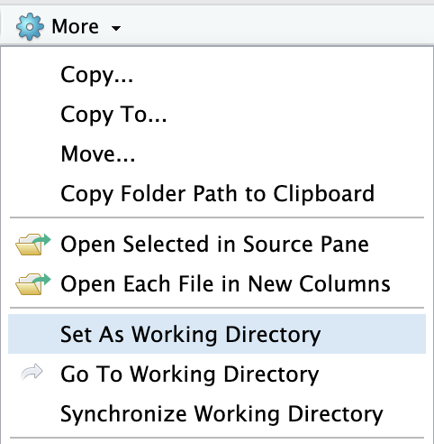

```{r setup, include=FALSE}
knitr::opts_chunk$set(echo = TRUE, comment='#')
options(width = 60)  # to fit output on slides
```

## Prerequisites

-   Access to a copy of the [, "html", "logo.jpg")`){height=1em}](https://www.r-project.org) software

    -   i.e., a "binary executable"

    -   Go to [*www.r-project.org*](https://www.r-project.org) to get a copy, \
        or ask your system administrator.

- Tidyverse packages installed on the same system as $\R$

  - Please run this command in $\R$ *before* the workshop:
    ```{r install_tidyverse, eval=FALSE}
    install.packages("tidyverse")
    ```

-   Knowledge of common mathematical operations: arithmetic, logarithms, etc.

-   Knowledge of basic $\R$ concepts, such as *variables*, *objects*, *operators*, *functions*, *packages*, etc.

    -   This is covered in the first workshop: "A Gentle Introduction to R"

<!-- R logo: , "html", "logo.jpg")`){height=1em} -->


## Learning Objectives

- Load tabular data into R
- Explore data to check that it was loaded correctly
- Export data from R to external files
- Data frames
- Clean data
  - Add & change columns
  - Edit values systematically
  - Change data types
- Tidy data
  - Change the _shape_ of a data frame
- Re-use code, reproducible results, automated reports
  - Scripts
  - R Markdown, R Notebooks

# Welcome

## Pop Quiz

\annote{\fade{We will review these \textit{at the end}, so you can see how much you have learned.}}

+ If multiple packages have functions with the same name,
  how can you specify which one to use?
+ Does $\R$ store data in memory or temporary files?
+ What is the limit to the size of objects and datasets that can be loaded into $\R$?
+ TRUE or FALSE: $\R$ has rules and conventions for naming functions
+ TRUE or FALSE: if you use one package from the `tidyverse`, you have to use all of them.

```{r welcome, echo=FALSE, results='asis'}
if (params$is_virtual) {
  cat("\\ 
  \n### Answer in the chat:
  \n
  \nWhat is your favourite emoji?  Why do you like to use it so much?
  ")
}
```


## Introductions

- Name
- Pronouns
- Job title, role
- _optional_: a favourite childhood treat or candy?

<!-- -->

- What are you hoping to learn most in today's workshop?


## Disclaimer

- There is often more than one way to achieve a desired result in $\R$

- Some are faster in certain situations

- Some require less code, or are easier to write as code

- Some are more portable (work on multiple systems)

- But there is rarely as single 'best way'.

This workshop focuses on a coherent approach,
that can be learned more easily and extended as needed
to tackle bigger problems.

Feel free to take what you learn here
and experiment, or explore alternatives.
Find what works for _you_.


# Loading data into $\R$

## The Working Directory

- When working with external files, it helps to know the current _working\ directory_
  - Any paths supplied to $\R$ functions will be relative to this path.

```r
getwd()
```

- You can change the working directory with this command:

```r
setwd('path/to/a/directory')
```

## Set the working directory

- For this workshop, set the working directory to location where you downloaded
  this presentation and accompanying files.
  - the directory that _contains_ the folder named '`files`'
    that was downloaded along with the files for this workshop.

:::::: {.columns .onlytextwidth}
::: {.column width="58%"}
* Base $\R$ on Mac / Linux:

  - Menu item: "Misc > Change Working Directory..."
  - `CMD+D` on Mac; `CTL+D` on Linux (or Windows)

:::
::: {.column width="38%"}
* Base $\R$ on Windows:

```r
setwd( choose.dir() )
```

:::
::::::
```{=latex}
\medskip
```
:::::: {.columns .onlytextwidth}
::: {.column width="58%"}

* In R\ Studio,
  you can use the _Files_ pane (default bottom-right)
  to navigate to a directory in your system,
  and click on "*More > Set As Working Directory*"
  - or "*Session > Set Working Directory > To Files Pane Location*" 
    in the R\ Studio menu.

:::
::: {.column width="38%"}

{width=80%}
:::
::::::

::: notes
  - R Studio also has a menu item to conveniently set the working directory to the same location as a file in the 'Source' pane.  
    We'll use that later with source files.
:::


## Check your working directory

- Check to see that the working directory is in the right place:

  ```{r check_wd}
  file.exists("data_example.csv")
  ```

- If the result of the statement above is not "`TRUE`{.r}" in your session,
  try one of the [other approaches](#set-the-working-directory)
  to change your working directory, and try again.


## csv files

- 'csv' = **C**omma **S**eparated **V**alues
  - files in this format have a '`.csv`' file extension.
  
- They are:
  - plain text files
  - used to represent tabular data, 
    with each *row* on a line, and values in each *column* separated by commas (`,`)
  - readable by a wide variety of analysis software (highly portable)
  - simple---no embedded metadata

- We'll try to load this file into $\R$:  
  `example_data.csv`
  - *optional: you can try opening it in a text editor, or spreadsheet software,
    to see what's in the file.*


## Load a csv file into $\R$ (basic)

```r
read.csv("data_example.csv")
```
```{r load1, echo=FALSE}
try( read.csv("data_example.csv") )
```

. . .

- Uh oh!  Something's not right.


## Check the file contents

- Let's take a peek at the first few lines and see if we can identify the problem:
```{r readlines}
readLines("data_example.csv", n = 4)
```
. . .

- The first **2** lines don't look like comma-separated values!

- They look like extra information that is not part of the data table *structure*.


## Load a csv file into $\R$

- We can tell $\R$ to skip the lines with no data:
  - and we'll *assign* the result to a variable
    so we can work on it
  
```{r load}
DF <- read.csv("data_example.csv", skip = 2)
```

- Just because there were no `Error`{.r}s from $\R$, 
  doesn't mean there's nothing wrong with the data!


# Exploring your data

## Object class: data frame

Before we explore our new data set, first a short review of the kind of *object* we're dealing with:

```{r data.frame}
class(DF)
typeof(DF)
```

## Data frames

<!--
- Data frames (review)
- head, str, names, plot?
- View / R Studio Environment pane
- Know Your Data
-->

## `head()`: peek at the first few rows

```{r head}
head(DF)
```


## Dimensions (rows & columns)

```{r dims}
dim(DF)
nrow(DF)
ncol(DF)
```

## *Names* of elements (columns)

```{r colnames}
names(DF)
colnames(DF)
```

## Look at a column {.shrink}

**Remember:** you can refer to elements within a data frame by *name*.

```{r}
DF$Treatment
DF[, "Type"]
```

### !

Looks like there might be some inconsistencies in the `Type` column.
We'll learn how to fix those soon, 
but these simple functions are already helping us understand our data.

## `str()`: structure of the object

```{r str}
str(DF)
```

### Tip
_the `str()`{.r} and `names()`{.r} functions can be used with **any** object_


## Simple plots {.shrink}

```{r plot_basic}
plot(DF)
```


## Spreadsheet-like `View()`

``` r
View(DF)
```
- This command opens a data frame in a spreadsheet-like view,
  which can be easier to navigate.

<!-- base R View() screenshot -->

- In R Studio, you can achieve the same thing by double-clicking
  on an object name in the '*Environment*' pane (default upper-right)
  - The `View()`{.r} pane in R Studio (default upper-left; '*Source*') 
    also allows for sorting and filtering,
    but these do not change the viewed object, only the view.

<!-- R Studio Environment Pane screenshot -->
<!-- R Studio View screenshot -->

## Know Your Data

- These functions are useful for exploring different aspects of a loaded data set

- But they won't tell you if these are _correct_.

- Ideally, you should always "Know Your Data",
  and use these functions to verify that the data was loaded correctly.
  - Are the number of rows and columns correct?
  - Are the different columns of the expected type (numeric, character, etc.)?
  - Are the values correct?
  - Is anything missing, or different than expected?


# Downloading data from the internet

<!--
- downloading data from the internet (to a temp dir)
  - the same local file, directly from the URL on GitHub
  - CANSIM / NDMr / other package?
-->


# Saving data outside $\R$

<!--
- write.csv
- Extras: exporting to Excel?
- .Rdata files?
- Projects?
-->

# Re-using your code: scripts and other files

<!--
+ What is a script? Why use a script?
  - Make a simple script that does what we've done so far?
+ The comment character '#'
- never use setwd() in a script!
+ Flow-control
  - if () else
  - for () loop
+ defining your own functions
  - anonymous functions? (*introduce when it becomes relevant*, later)
  * write a custom function for comparing values in two vectors with NAs
    - http://www.cookbook-r.com/Manipulating_data/Comparing_vectors_or_factors_with_NA/
    - https://stackoverflow.com/questions/37610056/how-to-treat-nas-like-values-when-comparing-elementwise-in-r
+ Style Guides
  - https://style.tidyverse.org/syntax.html
  - https://google.github.io/styleguide/Rguide.html
+ Rmd, Notebooks? (save for later?)\
  - Brief mention, demo
-->


# The `tidyverse` collection of packages

## The `tidyverse`

``` r
install.packages("tidyverse")
help(package="tidyverse")
```

- The [`tidyverse`](https://www.tidyverse.org/) is an "opinionated" [collection of packages](https://www.tidyverse.org/packages/) that are designed to work together.

- All packages share an underlying design philosophy, grammar, and data structures.
  - _Unlike base $\R$_ <!-- and some other packages -->
  - Shared naming conventions (e.g., '`_`' instead of '`.`' in function names)
  - Emphasis on functions that do one thing well
  - Designed to be combined together to achieve complex operations

- `tidyverse` is under active development.
  - New functions and features sometimes replace or supersede old ones.
  - No guarantee that functions will continue to work the same way in future versions.

::: notes
These characteristics means tidyverse packages may not be ideal in a production environment.
Nevertheless, the package designers are pretty good about replacing old functions with new ones, to avoid disruptive changes, and keeping older functions around, though with only minimal support.
I have code from 10+ years ago that will not run in current versions of R because of the number of changes to dplyr and related packages over the years.

But I still like dplyr and the tidyverse, because they are coherent with each other.
Although they can be complex, and take advantage of some arcane aspects of R,
they do make it easier to translate ideas into code --- once you understand the grammar.
The consistency in naming and argument syntax, however, is also hugely appealing in terms of fewer new things to learn while expanding your toolbox.

Write code that works and that you understand: then take time to revise and optimize, based on your needs and capacity.
:::


## Core `tidyverse` packages

Today, we will focus on a few of the core `tidyverse` packages for loading, cleaning, and manipulating data:

* [readr](https://readr.tidyverse.org/), [readxl](https://readxl.tidyverse.org/) for **loading** data
<!-- * [tibble](https://tibble.tidyverse.org/) for a 'modern' version of `data.frame`s that behave slightly differently (but are compatible with `data.frame`s). -->
* [dplyr](https://dplyr.tidyverse.org/) for **manipulating** data (values)
* [tidyr](https://tidyr.tidyverse.org/) for **rearranging** data
* [stringr](https://stringr.tidyverse.org/) for working with **strings**


## `dplyr`: grammar of data manipulation

- `dplyr` provides many functions, within a coherent framework or _grammar_  
  
- They are intended to help you focus on _what_ you want to do, 
    and translate your thoughts into code.

- High-level functions have active names and called "**verbs**" --- they describe what they do.

- `dplyr` and `tidyr` provide many "**helper functions**" that work _inside_ verbs 
  and other functions to make many tasks easier to translate into code.
  - These functions may not work on their own, outside of `dplyr` verbs and `tidyr` functions.


## `dplyr` verbs

Verbs can be grouped based on the component of the dataset that they work with[^1-table-verbs]:

- Rows:
  - `filter()`{.r} chooses rows based on column values.
  - `slice()`{.r} chooses rows based on location.
  - `arrange()`{.r} changes the order of the rows.
- Columns:
  - `select()`{.r} changes whether or not a column is included.
  - `rename()`{.r} changes the name of columns.
  - `mutate()`{.r} changes the *values* of columns and creates new columns.
  - `relocate()`{.r} changes the order of the columns.
- Groups of rows:
  - `group_by()`{.r} defines groups of rows.
  - `summarise()`{.r} collapses a group into a single row.
  

[^1-table-verbs]: https://dplyr.tidyverse.org/articles/dplyr.html#single-table-verbs


::: notes

:::


## `dplyr` *semantics*

`dplyr` verbs and helper functions let you refer to column names
of the data frame directly in their arguments 
as regular variables --- without having to quote them.
But these names have different meanings (semantics) in different verbs.

* **"select semantics"**: in `select()`{.r} and similar functions, 
  a column name refers to its _position_ in the data frame.
  - you can refer to a column as a quoted string in `select()`{.r},
    and it is interpreted as a reference to the column.

* **"mutate semantics"**: in `mutate()`{.r},
  a column name refers to a _vector of values_.
  - you cannot supply a column name as a string in `mutate()`{.r},
    because it is treated as a vector of length 1, 
    rather than a reference to a column of values.

::: notes
https://dplyr.tidyverse.org/articles/dplyr.html#patterns-of-operations
`vignette("dplyr")`{.r}
:::


## A 'pipe' operator  {.shrink}

:::::: {.columns .onlytextwidth align=center}
::: {.column width="38%"}

 or "Ceci\ n'est pas une pipe" ("This\ is not a pipe") by René Magritte. 
<!-- [Image from Wikipedia](https://en.wikipedia.org/wiki/The_Treachery_of_Images#/media/File:MagrittePipe.jpg). -->
](images/MagrittePipe.jpg)

\centering

[{height=25%}](https://magrittr.tidyverse.org/)

:::
::: {.column width="58%"}

- The [`magrittr`](https://magrittr.tidyverse.org/) [package](https://cran.r-project.org/package=magrittr) (included with [`tidyverse`](https://www.tidyverse.org/packages/#program)) provides a "forward-pipe operator"<!--[^not-a-pipe]-->:

  ``` r
  %>%    # ?magrittr::`%>%`
  ```

- The `magrittr` package is automatically loaded when loading most `tidyverse` packages (e.g., `tidyr`, `dplyr`, `ggplot2`), as these packages all use this operator extensively.

  - It is often unnecessary to load `magrittr` separately, unless you are **not** using these other packages.

:::
::::::

<!-- [^not-a-pipe]: Although it is a 'pipe' operator, it does not contain a 'pipe' character (`|`), hence the reference to René Magritte's surrealist painting. -->

::: notes
`magrittr` logo downloaded from: https://github.com/tidyverse/magrittr/blob/main/man/figures/logo.png
:::


## `magrittr`'s 'forward-pipe' operator

- `%>%`{.r} allows you to pass results from an expression on the left-hand side (LHS) as an argument (usually the first) to a *function call* on the right-hand side (RHS).  

+--------------------------------+--------------------------------+
| This expression ...            | is equivalent to:              |
+================================+================================+
| ``` r                          | ``` r                          |
| x %>% f()                      | f(x)                           |
| ```                            | ```                            |
+--------------------------------+--------------------------------+
| ``` r                          | ``` r                          |
| x %>% f(y)                     | f(x, y)                        |
| ```                            | ```                            |
+--------------------------------+--------------------------------+
| ``` r                          | ``` r                          |
| x %>% f(y, z = .)              | f(y, z = x)                    |
| ```                            | ```                            |
+--------------------------------+--------------------------------+
| ``` r                          | ``` r                          |
| x %>% f %>% g %>% h            | h(g(f(x)))                     |
| ```                            | ```                            |
+--------------------------------+--------------------------------+

- This can make code easier to read, as expressions are written and evaluated from _left to right_, rather than from _inside to outside_ nested parentheses.


## $\R$ now has a 'native' pipe operator

- A pipe operator was introduced in base $\R$ in v4.1 (May 2021)[^R4.1]:

  ``` r
  |>    # ?pipeOp
  ```

- It was inspired by the "forward pipe operator" introduced by `magrittr`, but is more streamlined. 
  See these links for details:

  - [Differences between the base R and magrittr pipes](https://www.tidyverse.org/blog/2023/04/base-vs-magrittr-pipe/)
  - "[Understanding the native R pipe |>](https://towardsdatascience.com/understanding-the-native-r-pipe-98dea6d8b61b)"

- Because it is so new, most code examples online still use '`%>%`{.r}' from `magrittr`.  

- But '`|>`{.r}' is always available *in $\R$ >= v4.1*, 
  without having to load additional packages.
  
- This document will use '`%>%`{.r}' in the examples, 
  for consistency and because many `tidyverse` functions
  were designed to work with it.


[^R4.1]: https://cran.r-project.org/bin/windows/base/old/4.1.0/NEWS.R-4.1.0.html


## Pipes: exercise


# Clean data

<!--
+ filter()
  - package::function notation (to distinguish from other functions named 'filter')
  - near()?
  - duplicates: find, drop [after merging?]
+ select()
+ mutate()
+ editing values systematically
  - ifelse()
  - case_when()
+ summarize()
+ combining datasets
  - rbind / bind_rows
  - cbind / bind_cols
  - join() [mention merge()?]
  - exercise: summarize a dataset and merge back with original for calculation?
    - or just group_by() & mutate()
+ sorting; arrange()
  - group_by()
+ exercise: clean some values in Example File loaded earlier.
-->


# Tidy data

## Tidy datasets

> > "Happy families are all alike; every unhappy family is unhappy in its own way."  
> > — Leo Tolstoy 
  \
  \
> "Tidy datasets are all alike but every messy dataset is messy in its own way."  
> --- Hadley Wickham (doi: [10.18637/jss.v059.i10](https://doi.org/10.18637/jss.v059.i10))


- Tidy datasets provide a standardized way to link the *structure* of a dataset (its physical layout) with its *semantics* (its meaning).

  - [`tidyr` vignette](https://cran.r-project.org/web/packages/tidyr/vignettes/tidy-data.html)


# Review

## Exercise

<!--
in pairs, or small groups:
write a script (or two companion scripts) that
- load a series of files in a folder
  - ue existing dataset, split up by a grouping variable (or year, etc.)
- cleans each one to be consistent (in a function)
- combines them into a single dataset
- re-arrange (pivot) the final dataset
- compare to reference file to test success?
  - have another team / person write a script to do this?
- export & save the file

One option is to have one person or group introduce some 'errors'
and have another try to fix them, but it's easy to introduce
very difficult issues to solve, so this can be risky and time-consuming.
Might work best with a few parameters to limit the kinds of changes that can be made.
-->


## [Quiz](#pop-quiz) Review

<!-- copy questions from [Pop Quiz][], above. -->


::: notes
`## Answers (for discussion)`

:::


# Backmatter

## Other packages to look at

- [`data.table`](https://rdatatable.gitlab.io/data.table/): a high-performance version of `data.frame` with few dependencies.

Other packages in the `tidyverse`:

- [`lubridate`](https://lubridate.tidyverse.org/) and [`hms`](https://hms.tidyverse.org/): for date & time values.

- [`purrr`](https://purrr.tidyverse.org/): functional programming (FP) tools for working with functions and vectors.  
  - Replace `for` loops with code that is more efficient and easier to read.


## Writing to Microsoft Excel^TM^ files  {.shrink}
<!-- move to `extras`? -->

Packages that can write to Excel files:

- [`xlsx`](https://github.com/colearendt/xlsx): read, write, format Excel\ 2007 (`.xlsx`) and Excel\ 97/2000/XP/2003 (`.xls`) files.
  - Depends on Java and the `rJava` package

- [`XLConnect`](https://github.com/miraisolutions/xlconnect): comprehensive and cross-platform R package for manipulating Microsoft Excel files (`.xlsx` & `.xls`) from within R.
  - Requires a Java Runtime Environment (JRE)

- [`openxlsx`](https://ycphs.github.io/openxlsx/index.html): simplified creation of Excel `.xlsx` files (**not** `.xls`).
  - _No dependency_ on Java

- [`writexl`](https://docs.ropensci.org/writexl/): portable, light-weight data frame to **xlsx** exporter. 
  - No Java or Excel required

### !

I recommend _avoiding_ exporting data to Excel files if possible.
`csv` files are easier to read to & write from, and can be read by a wider variety of software (they are more portable).  
Automated reports can be produced with R Markdown and output to a variety of more portable formats (pdf, HTML, etc.) instead. 

::: notes
As seen here, there are several packages for working with Excel files, with different advantages and disadvantages: you may have to do some testing to find the best fit for your situation.

I personally prefer the `openxlsx` package, because in my experience, the dependency on Java can be difficult to get working and unreliable.  But I have no experience with `writexl`, which is newer and possibly faster than the others.  
The main trade-off is the openxlsx cannot write to `.xls` files (Excel 97/2000/XP/2003 format) and has fewer formatting options than other packages --- but if you need that much formatting, why not produce a formatted report with R Markdown?
:::


## References

Cheatsheets:

- [readr/readxl](https://rstudio.github.io/cheatsheets/html/data-import.html)
- [Data transformation with dplyr](https://rstudio.github.io/cheatsheets/html/data-transformation.html)
- [Data tidying with tidyr](https://rstudio.github.io/cheatsheets/html/tidyr.html)

::: notes
https://cran.rapporter.net/doc/contrib/de_Jonge+van_der_Loo-Introduction_to_data_cleaning_with_R.pdf
https://r4ds.hadley.nz/data-transform.html (https://r4ds.had.co.nz/transform.html)
  https://github.com/rstudio-education/r4ds-instructors
  https://dplyr.tidyverse.org/articles/dplyr.html#single-table-verbs
  https://dplyr.tidyverse.org/articles/two-table.html
https://education.rstudio.com/teach/materials/
  https://github.com/rstudio-education/remaster-the-tidyverse/blob/master/README.md
  https://datasciencebox.org/
  https://rladiessydney.org/courses/ryouwithme/02-cleanitup-0/
https://posit.cloud/learn/primers

CANSIM data:
https://mountainmath.ca/canssi/#1
https://mountainmath.github.io/canadian_data/

Working directory & scripts:
https://stackoverflow.com/questions/3452086/getting-path-of-an-r-script
https://stackoverflow.com/questions/47044068/get-the-path-of-current-script
https://cran.r-project.org/web/packages/this.path/this.path.pdf

Other related tutorials:
https://posit.co/resources/videos/a-gentle-introduction-to-tidy-statistics-in-r/

:::
