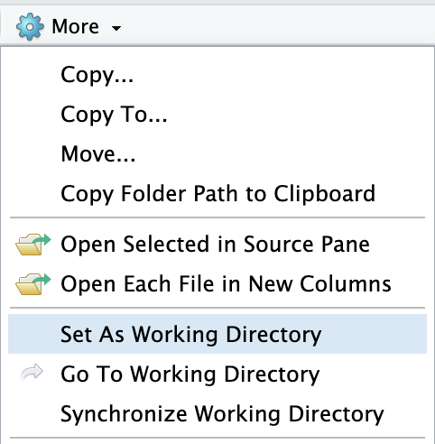

```{r setup, include=FALSE, purl=FALSE}
knitr::opts_chunk$set(echo = TRUE, comment='#')
knitr::opts_knit$set(root.dir = "..")  # run all code as if in the parent directory
options(width = 60)  # to fit output on slides
```

```{r Housekeeping, include = FALSE}
################################################################
### A Short Introduction to Working With Data in R
### All code from workshop slides (automatically generated)
### Jonathan Whiteley           R v4.3.1              2023-09-18
################################################################
## Housekeeping: clear memory
if (F) # do not run when source()d
  rm(list = ls())
```


## Prerequisites {.shrink}

-   Access to a copy of the [, "html", "logo.jpg")`){height=1em}](https://www.r-project.org) software
    -   Get it from [*www.r-project.org*](https://www.r-project.org), 
        or ask your system administrator.

- Tidyverse packages installed on the same system as $\R$
  - Please run this command in $\R$ *before* the workshop:
    ```{r install_tidyverse, eval=FALSE}
    install.packages("tidyverse")
    ```

- Download the [workshop files](https://github.com/jawhiteley/R_training_jaw/tree/main/R2_data_scripting), including these slides, data, and scripts.
  - The workshop assumes the same file structure as in the link above.

-   Knowledge of common mathematical operations: arithmetic, logarithms, etc.

-   Knowledge of basic $\R$ concepts, such as *variables*, *objects*, *operators*, *functions*, *packages*, etc.

    -   This is covered in the first workshop: "A Gentle Introduction to R"

::: notes
<!-- R logo: , "html", "logo.jpg")`){height=1em} -->

- I will use an example data file to demo various cleaning & manipulation steps
- Exercises, however, should generally **stand-alone**
  - Exercises are an opportunity to try to apply knowledge, experiment, sometimes fail, and discuss 
    --- _success_ is not the primary objective.
  - Messing up an exercise should not derail your progress on future exercises.
:::


# Welcome

## Pop Quiz

\annote{\fade{We will review these \textit{at the end}, so you can see how much you have learned.}}

+ If multiple packages have functions with the same name,
  how can you specify which one to use?
+ Does $\R$ store data in memory or temporary files?
+ What is the limit to the size of objects and datasets that can be loaded into $\R$?
+ TRUE or FALSE: $\R$ has rules and conventions for naming functions
+ TRUE or FALSE: if you use one package from the `tidyverse`, you have to use all of them.

```{r welcome, echo=FALSE, results='asis', purl=FALSE}
if (params$is_virtual) {
  cat("\\ 
  \n### Answer in the chat:
  \n
  \nWhat is your favourite emoji?  Why do you like to use it so much?
  ")
}
```


## Introductions

- Name
- Job title, role

_If you are comfortable sharing_:

- Pronouns
- A hobby or activity you enjoy

<!-- -->

- What are you hoping to learn most in today's workshop?


## Learning Objectives

- Load tabular data into R
- Explore data to check that it was loaded correctly
- Export data from R to external files
- Data frames
- Clean data
  - Re-arrange & modify rows
  - Add & change columns
  - Edit values systematically
  - Change data types
- Tidy data
  - Change the _shape_ of a data frame
- Re-use code, reproducible results <!--, automated reports  -->
  - Scripts
  <!--
  - R Markdown, R Notebooks
  -->

## Disclaimer

- There is often more than one way to achieve a desired result in $\R$

- Some are faster in certain situations

- Some require less code, or are easier to write as code

- Some are more portable (work on multiple systems)

- But there is rarely a single 'best way'.

This workshop focuses on a coherent approach,
that can be learned more easily and extended as needed
to tackle bigger problems.

Feel free to take what you learn here
and experiment, or explore alternatives.
Find what works for _you_.

### info

I may not speak to all slides during the workshop:
some are mostly for reference, but may be helpful 
for the activities that you do on your own.


# The `tidyverse` collection of packages

## The `tidyverse`

``` r
install.packages("tidyverse")
help(package="tidyverse")
```

- The [`tidyverse`](https://www.tidyverse.org/) is an "opinionated" [collection of packages](https://www.tidyverse.org/packages/) that are designed to work together.

- All packages share an underlying design philosophy, grammar, and data structures.
  - _Unlike base $\R$_ <!-- and some other packages -->
  - Shared naming conventions (e.g., '`_`' instead of '`.`' in function names)
  - Emphasis on functions that do one thing well
  - Designed to be combined together to achieve complex operations

- `tidyverse` is under active development.
  - New functions and features sometimes replace or supersede old ones.
  - No guarantee that functions will continue to work the same way in future versions.

::: notes
These characteristics means tidyverse packages may not be ideal in a production environment.
Nevertheless, the package designers are pretty good about replacing old functions with new ones, to avoid disruptive changes, and keeping older functions around, though with only minimal support.
I have code from 10+ years ago that will not run in current versions of R because of the number of changes to dplyr and related packages over the years.

But I still like dplyr and the tidyverse for analysis, because they are coherent with each other.
Although they can be complex, and take advantage of some arcane aspects of R,
they do make it easier to translate ideas into code --- once you understand the grammar.
The consistency in naming and argument syntax, however, is also hugely appealing in terms of fewer new things to learn while expanding your toolbox.

Write code that works and that you understand: then take time to revise and optimize, based on your needs and capacity.
:::


## Core `tidyverse` packages

Today, we will focus on a few of the core `tidyverse` packages for loading, cleaning, and manipulating data:

* [readr](https://readr.tidyverse.org/), [readxl](https://readxl.tidyverse.org/) for **loading** data
<!-- * [tibble](https://tibble.tidyverse.org/) for a 'modern' version of `data.frame`s that behave slightly differently (but are compatible with `data.frame`s). -->
* [dplyr](https://dplyr.tidyverse.org/) for **manipulating** data (values)
* [tidyr](https://tidyr.tidyverse.org/) for **reshaping** data
* [stringr](https://stringr.tidyverse.org/) for working with **strings**


# File Paths and The Working Directory

## The Working Directory

- When working with external files, it helps to know the current _working\ directory_
  - Any paths supplied to $\R$ functions will be relative to this path.

```{r 2.get_working_dir, results='hide'}
getwd()
```

- You can change the working directory with this command:

```r
setwd('path/to/a/directory')
```

## File paths

- A *file path* is a *character string* that represents the location of a file
  in your system (computer and OS)
  
- The format of paths can depend on the operating system (OS)

  - Some use `"/"` to separate directories
    - e.g., "`/dir/subdir`"
    
  - Windows uses `"\"`
    - e.g., `"C:\\dir\subdir"`
    - $\R$ uses this as an escape character in strings, and must be escaped itself in paths (`"\\"`)
    - e.g., `"C:\\\\dir\\subdir"`


## Paths in $\R$

- $\R$ generally uses and understands `"/"` in paths, even on Windows.[^file-paths]

  - e.g.,\ `"C:/dir/subdir"`
  - on Windows, it also understands Windows-style paths: 
    e.g,\ `"C:\\\\dir\\subdir"`

- $\R$ also has platform-independent functions for manipulating paths, 
  such as `file.path()`{.r},
  which I will use in examples to make them as reproducible as possible.

[^file-paths]: For the gory details, see section 14.2 "Filepaths" in "An Introduction to R" (`help.start()`{.r}), `?file.path`{.r}, and documentation for related functions.


## My paths are not like yours

- Directory (folder) names can also vary from one computer to another
  --- it's difficult to show a path in this document that will also work on your computer!

- Once you set a working directory _on your computer_ 
  based on the structure of the files in this project,
  we can use _relative paths_ that should also work on your computer 
  (assuming your downloaded the workshop files in the same structure as provided).


## Set the working directory

- For this workshop, set the working directory to location where you downloaded
  this presentation and accompanying files.
  - the directory that _contains_ the folder named '`data`'
    that you downloaded along with the files for this workshop.

```{r setwd, eval=FALSE, echo=FALSE, results='hide', include=FALSE}
Before running the commands in this file,
set your working directory (*in the console*)
to the folder that *contains* the 'data' folder
(i.e., the workshop folder, as it appears on the web site.)

setwd("path/to/the/folder")
if (.Platform$OS.type == "windows") {
  setwd( choose.dir() )
}
```

:::::: {.columns .onlytextwidth}
::: {.column width="58%"}
* Base $\R$ on Mac / Linux:

  - Menu item: "Misc > Change Working Directory..."
  - `CMD+D` on Mac; `CTL+D` on Linux (or Windows)

:::
::: {.column width="38%"}
* Base $\R$ on Windows:

```r
setwd( choose.dir() )
```

:::
::::::
```{=latex}
\medskip
```
:::::: {.columns .onlytextwidth}
::: {.column width="58%"}

* In RStudio,
  you can use the _Files_ pane (default bottom-right)
  to navigate to a directory in your system,
  and click on "*More > Set As Working Directory*"
  - or "*Session > Set Working Directory > To Files Pane Location*" 
    in the RStudio menu.

:::
::: {.column width="38%"}

{width=80%}
:::
::::::

::: notes
  - RStudio also has a menu item to conveniently set the working directory to the same location as a file in the 'Source' pane.  
    We'll use that later with source files.
:::


## Check your working directory

- Check to see that the working directory is in the right place,
  by checking to see if a known file exists (from $\R$'s perspective):

```{r check_wd}
CSV_path <- file.path("data", "data_example.csv")
file.exists(CSV_path)
```

- If the result of the statement above is not "`TRUE`{.r}" in your session,
  try one of the [other approaches](#set-the-working-directory)
  to change your working directory, and try again.


# Load Data: The `readr` & `readxl` Packages

## csv files

- 'csv' = **C**omma **S**eparated **V**alues
  - files in this format have a '`.csv`' file extension.
  
- They are:
  - plain text files
  - used to represent tabular data, 
    with each *row* on a line, and values in each *column* separated by commas (`,`)
  - readable by a wide variety of analysis software (highly portable)
  - simple---no embedded metadata

- We'll try to load this file into $\R$:  
  `example_data.csv`
  - *optional: you can try opening it in a text editor, or spreadsheet software,
    to see what's in the file.*


## Load a csv file using `read_csv()`

```r
?read_csv
```
```{r load with read_csv (1st try), results='hide', message=FALSE, warning=TRUE}
library(readr)
try( read_csv(CSV_path) )
```

. . .

- Uh oh!  Something's not right.


## Check the file contents

- Let's take a peek at the first few lines and see if we can identify the problem:
```{r readlines}
readLines(CSV_path, n = 4)
```
. . .

- The first **2** lines don't look like comma-separated values!

- They look like extra information that is not part of the data table *structure*.


## Load a csv file into $\R$

- We can tell $\R$ to skip the lines with no data:
  - and we'll *assign* the result to a variable
    so we can work on it
  
```{r load with read_csv}
CSV <- read_csv(CSV_path, skip = 2)
```

- Just because there were no `Error`{.r}s or `Warning`{.r}s from $\R$, 
  doesn't mean there's nothing wrong with the data!


# Exploring Your Data

## Object class: data frame

Before we explore our new data set, let's quickly review the kind of *object* we're dealing with:

```{r data.frame}
class(CSV)
typeof(CSV)
```

## Data frames

```{r data.frame view, echo=FALSE, purl=FALSE}
CSV_sub <- CSV[1:7, 1:7]
CSV_sub[8, 1] <- "..."
CSV_sub[, "..."] <- ""
knitr::kable( CSV_sub )
```

- **columns** = _data variables_
- **rows** = observations, cases

<!--
- Data frames (review)
- head, str, names, plot?
- View / RStudio Environment pane
-->


## Data frames: _structure_

- Each column contains data of the _same type_

```{r data.frame review, echo=FALSE, purl=FALSE}
str( as.data.frame(CSV) )
```

### !
`readr` doesn't just read data into a `data.frame`, 
but the result is _also_ a `tibble` (`"tbl_df"`).


## Tibbles: `data.frame`s reimagined

* A ['tibble'](https://tibble.tidyverse.org/) (`class()`{.r} == `"tbl_df"`) is 
  "a modern reimagining of the data.frame".
  - See the [package documentation](https://tibble.tidyverse.org/) for details.

+ Many tidyverse functions produce tibbles by default.

+ **Tibbles are _also_ `data.frame`s**, and *inherit* from that class.
  - functions that work with `data.frame`s should also work with tibbles.
  - but some may behave differently (by design).
  - for example, `print()`ing a tibble includes slightly more information,
    and only prints a few rows and columns by default,
    preventing large datasets from overwhelming your console.
  - when indexing a tibble, it will _not_ do partial matching on column names,
    making it clear if a column exists or not

+ For most purposes, tibbles are interchangeable with `data.frame`s.
  - A tibble can be converted to a 'plain' `data.frame` 
    with `as.data.frame()`{.r} if necessary.


## `head()`: peek at the first few rows

```{r head}
head(CSV)
```


## Dimensions (rows & columns)

```{r dims}
dim(CSV)
nrow(CSV)
ncol(CSV)
```


## *Names* of elements (columns)

```{r colnames}
names(CSV)
colnames(CSV)
rownames(CSV)
```


## Look at a column {.shrink}

**Remember:** you can refer to elements within a data frame by *name*.

```{r}
CSV[["Treatment"]]
unique(CSV$Type)
```

### !

Looks like there might be some missing values in the `Treatment` column, and inconsistencies in the `Type` column.
We'll learn how to fix those soon, 
but these simple functions are already helping us understand our data.


## `str()`: structure of an object

```{r str, results='hide', purl=TRUE}
str(CSV)
```
```{r str tibble, echo=FALSE, purl = FALSE}
str( dplyr::mutate(CSV) )  # to drop extra attributes
```

### Tip
_The `str()`{.r} and `names()`{.r} functions can be used with **any** object._


## `summary()`: statistical summaries by column

```{r summary}
summary(CSV)
```


## Simple plots {.shrink}

```{r plot_basic}
plot(CSV)
```


## Spreadsheet-like `View()`

``` r
View(CSV)
```
- This command opens a data frame in a spreadsheet-like view,
  which can be easier to navigate.

<!-- base R View() screenshot -->

- In RStudio, you can achieve the same thing by clicking
  on an object name in the '*Environment*' pane (default upper-right)
  - The `View()`{.r} pane in RStudio (default upper-left; '*Source*') 
    also allows for sorting and filtering,
    but these do not change the object in your session, only the view.

<!-- RStudio Environment Pane screenshot -->
<!-- RStudio View screenshot -->


## Know Your Data

- These functions are useful for exploring different aspects of a loaded data set

- But they won't tell you if these are _correct_.

- Ideally, you should always "Know Your Data",
  and use these functions to verify that the data was loaded correctly.
  - Are the number of rows and columns what you expected?
  - Are the different columns of the expected type (numeric, character, etc.)?
  - Are the values in the expected range and format?
  - Is anything missing, or different than expected?


## The `CO2` dataset: background

The example data file is based on the `'CO2'` dataset 
available in $\R$ (`?CO2`),
with a few changes added to make things interesting.

From the documentation:

> The CO2 uptake of six plants from Quebec and six plants from Mississippi 
> was measured at several levels of ambient CO2 concentration. 
> Half the plants of each type were chilled overnight before the experiment was conducted.

```{r load internal CO2 data}
data(CO2)
```


## **Activity** 1: what's wrong with this data?

The original dataset has the following properties (`str(CO2)`{.r}):

- 84 rows and 5 columns

  --------------  ------------------------------------------------
  Column Name     Description
  --------------  ------------------------------------------------
  `Plant`          factor with 12 levels:
                   Qn1, Qn2, ... Mc3, Mc1

  `Type`           factor with 2 levels:
                   "Quebec" and "Mississippi"
  
  `Treatment`      factor with 2 levels:
                   "nonchilled" and "chilled"
  
  `conc`           numeric: ambient carbon dioxide 
                            concentrations (mL/L)

  `uptake`         numeric: carbon dioxide uptake rates 
                            ($\mu$mol/m^2^$\cdot$sec)
  --------------  ------------------------------------------------

### Your turn

Using the functions described in this section, 
can you identify some possible issues and differences
with the data set you loaded?

_**Spoiler alert:** suggested answers on the next slide._


## Activity 1: what _is_ wrong with this data {.shrink}

- The data we loaded has different dimensions!
  - Values from the `conc` column are shown as *column names*
  - `uptake` values are the values of these columns
  - This isn't necessarily _bad_:
    such a structure can be useful for presentation
    and interpretation by people,
    but it is not _tidy_ and less convenient 
    for analysis & visualization (more on this later).

- Some of the `uptake` values are *character*,
  but should be *numeric*

- One of the `Type` values is spelled inconsistently:
  "Quebec"/"Québec"
  
- Some values in the `Treatment` column are empty
  - The value is only included when it changes
  
- The `PlantNum` column does not contain a unique identifier,
  as in the original `Plant` column
  - The values are no longer _unique_,
    without also considering the `Type` and `Treatment` columns.
  
_There are other differences you may have noticed:
 we'll look at ways to identify these automatically later._


# Re-using your code: scripts and other files

## Re-using code

Before we practice cleaning our data, and saving it to use later ...

- Imagine having to repeat the multiple steps to *load*, *clean*, and *save* a dataset.

  - How will you remember which *packages* you had to load?
  - How will you remember _all_ the steps, and their order?
  - What if you need to change _one_ step, but repeat all preceding steps?
  - How can you share your code with others, so that they can check your work, 
    or replicate your results?
  - How will you write out complex operations that require multiple steps,
    repeated operations, or only do things under certain conditions?

- The answer to all of these questions is: a ***script***

_Scripts and related files will also make it easier for you to follow along
with examples as they get more complicated---copy & paste into the console less often!_


## Scripts

An $\R$ *script* is a file that stores $\R$ code in *plain text*

- They have a `.R` file extension
- They are plain text files
  - so any text editor can read & write them
  - they also work well with **v**ersion **c**ontrol **s**ystems,  
    like [`git`](https://git-scm.com/), [GitHub](https://github.com/), and [GitLab](https://about.gitlab.com/))

- All the code in a script can be run in order
  - i.e., a *program*
- They make it easy to re-use code
- Scripts provide a record of the steps in a program or analysis
  - results are more *reproducible*
  - the code is a form of documentation

::: notes
- Most IDEs and text editors will show the text in different colours to distinguish different parts of the code
  - known as "syntax highlighting"
:::


## Make a new script

- In your $\R$ interface (R GUI, RStudio, IDE, etc.),
  open a new R script
    
  ----------------------------------------------------------------------
  Application   Menu item                           Keyboard shortcut 
                                                    (mac shortcut)
  ------------  ----------------------------        --------------------
  **R GUI**     `File > New Document`               `CTL+N` (`CMD+N`)
  
  **RStudio**   `File > New File > R Script`        `Shift+CTL+N` 
                 (`Shift+CMD+N`)
  ----------------------------------------------------------------------

- Save it with a name like "`my_first_script`[**`.R`**]{.underline}"
  - You can save it in the same location as the slides for this workshop
    (i.e., the folder _containing_ the '`data`' folder.)


## Add some code to your script

- Paste in the following code to your script file:

``` r
CSV_path <- file.path("data", "data_example.csv")
file.exists(CSV_path)

DF <- read.csv(CSV_path, skip = 2, encoding = "UTF-8")

colnames(DF)
plot(DF)
```

- and save it.


## Run $\R$ code in scripts

Most IDEs have a shortcut to send portions of $\R$ code (a line or *statement* spanning multiple lines) to an $\R$ session:
  
  - R GUI: `CTL+Return` (mac: `CMD+Return`)
  - RStudio: `CTL+Return` (mac: `CMD+Return`)

You can run _all_ the code in a script in different ways:

- The `source()`{.r} function, with a path to the script file as an argument
  - The code will run in the current session.
  - `?source`{.r}
  - `source("my_script.R")`{.r}
  
- Run $\R$ in "*batch mode*"
  - "*batch mode*" is **not** interactive (no prompt)
  - It is usually invoked from a terminal or other command-line (outside an $\R$ GUI)
  - The code in the script will run in a new session
  - You can capture output in a separate file
  - `?BATCH`{.r}

::: notes
Pause to let people try it out.
We will not be trying Batch Mode---it is mentioned for information only.
:::


## Comments {.shrink}

* The '**`#`{.r}**' character denotes a *comment* in $\R$
  - _Everything on a line_ after a comment character is ignored by $\R$
  - There are no 'multi-line' comments in $\R$

  ``` r
  print("this is R code")  # this is a comment
  ```

+ You can make an entire line a comment by putting a comment character at the beginning.
  - Divide your code into *sections*
    - `Shift+CTL+R` (`Shift+CMD+R`) in RStudio

  ``` r
  # SECTION -----------------------------------------------------------------
  ```
    
  - Create 'comment headers' for your scripts:

``` r
################################################################
### Title
### Project or description
### Author Name           R vX.X.X              YYYY-MM-DD
################################################################
```


## Comments in code

+ You can put a comment beside a line of code  
  (even in the middle of a mult-line statement)

  + $\R$ will ignore the rest of the line,
  and continue reading code on the next line

``` r
DF <-         # short for "data frame"
  read.csv(   # read a csv file
    CSV_path,  # path to file
    skip = 2  # skip lines at top of file (not data)
  )
```

+ Use comments to
  - organize your code (divide it into sections)
  - explain the code, where relevant
  - "comment-out" code temporarily,
    to stop it from running without deleting it
    (useful for debugging).
    - `Shift+CTL+C` (`Shift+CMD+C`) comment a line in RStudio
  <!-- - We'll learn how to stop code from running  -->
  <!--   based on conditions later. -->


## **Activity 2**: add some commands to your new script

- Take a few minutes to add some commands 
  you used in the last activity to your new script
  
  - **Tip:** use the up arrow to go back through your *command history*

- Be sure to add comments to explain your commands,
  or what you found with them.
  

## Open a script

* All the code shown in the slides for this workshop 
  has been collected in a script file:
  "`R_data_scripting.R`" (in the '`source`' folder)

* Open it to follow along for the rest of the workshop.

  ------------------------------------------------------------------------
  Application   Menu item                             Keyboard shortcut 
                                                      (mac shortcut)
  ------------  ----------------------------          --------------------
  **R GUI**     `File > Open Document...`             `CTL+O` (`CMD+O`)
  
  **RStudio**   `File > Open File...`                 `CTL+O` (`CMD+O`)
                
  ------------------------------------------------------------------------


## Set the Working Directory to source file location in **RStudio**

- Menu item: 
  "`Session > Set Working Directory > To Source File Location`"

- This makes it easy to use _relative paths_ in your script,
  relative to the location of the script file itself.
  
### For this workshop
  - All the code in this document
  assumes that the working directory
  is the _same directory_ as where the script file is.

<!-- if the script is in the `source` folder instead of the main folder:

  - After running the menu item above to set the working directory, 
    run this code in your console:
  ``` r
  setwd("..")  # move to the parent directory
  getwd()      # check the current working directory
  ```
  - The code in the script should now run without errors.
--> 


# Control how data is read: `read_csv()`{.r} options

## Encoding non-English characters {.shrink}

```{r reproduce windows latin1, include=FALSE, results='hide', purl = FALSE}
## Reproduce Windows encoding (bad)
CSV_win <- read.csv(CSV_path, skip = 2, encoding = "latin1")
## Extract example of messed up encoding
latin1_ex <- CSV_win |>
  dplyr::select(Type) |>
  dplyr::filter( ! Type %in% c("Quebec", "Mississippi") ) |> 
  unlist() |> unique()
## Read latin1 file using UTF-8 for the opposite
CSV_latin1 <- read_csv("data/data_example_latin1.csv", show_col_types = FALSE)
utf8_ex <- CSV_latin1 |>
  dplyr::select(Type) |>
  dplyr::filter( ! Type %in% c("Quebec", "Mississippi") ) |> 
  unlist() |> unique()
## printing this example inline may cause pandoc to use latin1 instead of UTF-8,
## which will mess up everything *else*. :(
```

- If you are running R in Windows, you may notice that 
  some text values (character) look strange:
  
  "**`r latin1_ex`**" or ""**Qu\\xe9bec**"
  instead of "Québec"

- There is nothing wrong with the file 
  --- this indicates a _mismatch_ between 
  the *encoding* used to write the file,
  and what $\R$ used to read it.

- Even though '`.csv`' files are plain text,
  letters (especially non-english characters)
  can be *encoded* in different ways
  to represent them in the computer.
  
- "[`UTF-8`](https://en.wikipedia.org/wiki/UTF-8)" 
  is a character encoding standard designed to handle many non-english characters.

  - The example data file was written in "`UTF-8`"
  - Most OSes and many programs use "`UTF-8`" encoding by default.
  - But *Windows* uses "`latin1`" by default,
    and so does $\R$ (< [4.2.0](https://stat.ethz.ch/pipermail/r-announce/2022/000683.html)) when running in Windows.
  - Starting with [v4.2.0](https://stat.ethz.ch/pipermail/r-announce/2022/000683.html), $\R$ uses "`UTF-8`" as the default encoding on Windows.


## Read a csv file with a mismatched encoding

```{r read a csv encoded in "latin1", message=FALSE, results='hide'}
CSV_latin1 <- read_csv("data/data_example_latin1.csv")
CSV_latin1
```
. . .
```{r, echo=FALSE, purl=FALSE}
head(CSV_latin1)
```


## `read_csv()`: read a file with a different encoding {.shrink}

- You can specify the encoding used in the file 
  with the '`locale`' argument of `read_csv()`{.r}
  
```{r read_csv() with encoding, results='hide', message=FALSE}
read_csv(CSV_path, skip = 2, 
         locale = locale(encoding = "latin1")
)
```

- You might need this to read a file that was 
  created on a Windows computer and encoded in "`latin1`"

### Microsoft Excel on Windows

Excel in Windows is capable of saving files in `.csv` format,
but may use "`latin1`" encoding by default. 
If it saves a `.csv` file using "`UTF-8`" encoding,
it may add extra contents to the file (a "BOM") 
that makes it difficult to read with `read.csv()`{.r} (base $\R$).  
See the "Extras" document for this workshop for details.  
_The `readr` package is not affected by the BOM._ :)

::: notes
See ?read.csv, ?Encoding, ?file, and other documentation for details.
:::


## `read_csv()`: column names

- The default for `read_csv()`{.r} is to 
  ensure all column names are _unique_,
  but not necessarily *syntactically valid*

- You can still refer to columns with syntactically 'invalid' names:
  - use functions that allow names as characters,
  - quote names with backticks (``` ` ```{.r})

```{r names with backticks, results='hide'}
CSV[, "95"]  # still a `data.frame` (with 1 column)
CSV[["95"]]  # vector
CSV$`95`     # quoted name
```

  
## `read_csv()`: treat column names

- Change how `read_csv()`{.r} treats column names
  with the '`name_repair`' argument
  
  - `"universal"`{.r} makes names unique and syntactic
  
```{r read_csv() name_repair universal, results='hide', message=FALSE}
read_csv(
  CSV_path, skip = 2, 
  name_repair = "universal" # make names unique and syntactic
)
```

- You can also pass a function by name  
  (`make.names` is the same behaviour as `read.csv()`{.r} in base $\R$)
  
```{r read_csv() name_repair make.names, results='hide', message=FALSE}
read_csv(
  CSV_path, skip = 2, 
  name_repair = make.names  # function: same as read.csv()
)  
```


## `read_csv()`: guessing column types

- By default, `read_csv()`{.r} prints a message summarizing what it did,
  including _guessing the data type_ of each column.
  
  - _`.csv` files do not include this information as metadata_

- Control how columns are guessed with the `guess_max` argument:

```{r read_csv() guess examples, results = 'hide', message=FALSE}
# use the first 2 rows to guess column types (less successful)
  read_csv(CSV_path, skip = 2, guess_max = 2)
# use *all* rows to guess column types
# - slow: has to read *every row* twice.
  read_csv(CSV_path, skip = 2, guess_max = Inf)
```

::: notes
The first example produces a warning, as expected.
:::


## `read_csv()`: specify column types

- If you know what the column types are (or should be),
  you can tell `read_csv()`{.r} what they are
  with the `col_types` argument.
  - for large datasets, this can be faster: read rows once
  - avoids bad guesses.
  
```{r read_csv() column spec, results = 'hide', message=FALSE, warning=FALSE}
## Specify column types with a compact string
read_csv(CSV_path, skip = 2, col_types = "cccddddddd")

## Or use a `column specification`
# extract specification from tibble
col_spec <- spec(CSV)
# change a column to numeric (double)
col_spec$cols[["500"]] <- col_double()
read_csv(CSV_path, skip = 2, col_types = col_spec)

# ?read_csv for more options
```


## `read_csv()`: all columns as strings

- In extreme cases, you can read everything as '`character`',  
  then clean and coerce to other data types within $\R$

```{r read_csv() all columns as character}
# read all columns as character
read_csv(CSV_path, skip = 2, 
         col_types = cols(.default = col_character())
         )
```


## `read_csv()`: missing values

- Use the `na` argument to supply a list of values
  to replace with `NA`{.r}.
  - This is applied to **all** columns.

```{r read_csv() na argument, message=FALSE, warning=FALSE}
read_csv(CSV_path, skip = 2, 
         na = c(".", "NA")  # will not replace empty strings ("") with NA
         )
```

::: notes
Skip these details if running behind.

The example actually produces a warning:
The missing values in lines 12 & 13 (including header row)
are read as an empty character string (""),
then dropped when coerced to numeric,
triggering the usual warning.
:::


## `read_csv()`: number formats

- `read_csv()`{.r} will attempt to read numbers with
  "." as the decimal, and "," between large numbers.

- But our example data includes a _mix_ of these.
  - This makes it difficult to choose one approach for everything,
    but one option in this case is to set the 'grouping' mark to an empty string

```{r read_csv() grouping_mark, message=FALSE, warning=FALSE}
CSV_comma <- read_csv(CSV_path, skip = 2, 
         locale = locale(grouping_mark = "")
)
CSV_comma[["675"]]
```

- With this option, column '`675`' is now *character* instead of *numeric*,
  With the commas intact.

- See also the '`decimal_mark`' argument of `locale()`{.r} (`?locale`)

::: notes
Skip these details if running behind.
:::


## **Final read of data for workshop**

- For the rest of this workshop, we will work with this version 
  of the example data file, read with `read_csv()`{.r}:

```{r read_csv() version to work with, message=FALSE}
DF <- read_csv(
  CSV_path, skip = 2, 
  name_repair = make.names
)  
```

- We use "make.names" to make *syntactically valid* names
  that are easier to work with later.


## The `readxl` package

Provides functions for reading from (but not writing to) Microsoft\ Excel files (`.xls` and `.xlsx`)

```{r readxl demo}
library(readxl)    # load the package
## Documentation: ?read_excel  help(package="readxl")
## use an example included in the package
xl_path <- readxl_example("datasets.xlsx")
excel_sheets(xl_path)  # get the names of the sheets
## read a specified sheet from the Excel file
iris_xl <- read_excel(xl_path, "iris")
```


## **Activity 3**: read a messy Excel file

- `read_excel()`{.r} has many of the same arguments as 
  `read_csv()`{.r} to control how data is imported.

- Use the script file in the "`examples`" folder as a starting point:
  - "`R2_activity_3.R`"

```r
XL_path <- readxl_example("deaths.xlsx")
XL <- read_excel(XL_path, ...)
```

. . .

### Tip

Use the '`range`' argument to read data from a specific range in a sheet, 
ignoring contents outside this range 
(rows above & below, columns before & after)

::: notes
Skip this exercise if running late.
:::


# Manipulate Data: The `dplyr` Package

## `dplyr`: a grammar of data manipulation

- `dplyr` provides many functions that follow a coherent framework or "_grammar_"
  
- They are intended to help you focus on _what_ you want to do, 
    and translate your thoughts into code.

- High-level functions have active names and called "**verbs**" --- they describe what they do.

- `dplyr` and `tidyselect` provide many "**helper functions**" that work _inside_ verbs 
  and other `tidyverse` functions to make common tasks easier to translate into code.
  - These functions may not work on their own, 
    outside of `dplyr` verbs and `tidyr` functions
    (see `?"faq-selection-context"`{.r}).

<!--
Use loaded data set for demos; `who` or `iris` data for exercises?
  - I would like participants to practice using internal datasets for exploration & testing code.
  - I don't want participants to get lost or derailed if they miss an exercise
  - Explore data with tidyverse functions:
    - identify non-numeric values in columns that should be numeric
      - NA comparisons

* MULTIPLE TABLES
  + combining datasets
    - rbind / bind_rows
    - cbind / bind_cols
    - join() [mention merge()?]
    - Exercise: summarize() a dataset and merge back with original for calculation?
      - or just group_by() & mutate()
* data masking? (advanced) ?args_data_masking
  * {{ var }} and when to use it?
  - https://dplyr.tidyverse.org/articles/programming.html
  - vignette("programming", package = "dplyr")
-->


## `dplyr` verbs

Verbs can be grouped based on the component of the dataset that they work with[^1-table-verbs]:

- Columns:
  - `select()`{.r} changes whether or not a column is included.
  - `relocate()`{.r} changes the order of the columns.
  - `rename()`{.r} changes the name of columns.
  - `mutate()`{.r} changes the *values* of columns and creates new columns.
- Rows:
  - `filter()`{.r} chooses rows based on column values.
  - `slice()`{.r} chooses rows based on location.
  - `arrange()`{.r} changes the order of the rows.
- Groups of rows:
  - `group_by()`{.r} defines groups of rows.
  - `summarise()`{.r} collapses a group into a single row.
  

[^1-table-verbs]: https://dplyr.tidyverse.org/articles/dplyr.html#single-table-verbs


::: notes

:::


## Load `dplyr`

- When you load `dplyr`, you may see a message saying "objects are masked":

```{r load dplyr}
library(dplyr)
```

- Some functions in `dplyr` have the same name as functions in other packages! 
  (`base`, `stats`)


## `package::object` notation

- When an "object is masked", it means the new one (`dplyr` function) will take precedence
  over the one being "masked" when a function of that name is called.
  
```{r masking, eval=FALSE}
?filter  # more than one result!
```

- To avoid confusion, you can specify which package you mean 
  with the "`package::object`" notation 
  (_functions_ are a class of _object_):
  
```{r package::object notation, eval=FALSE}
?filter  # more than one result
?dplyr::filter
?stats::filter
```

- Because `dplyr` has _masked_ the names from the other packages,
  we can simply call these functions normally (e.g., `filter()`{.r}),
  but if we wanted to use a masked function,
  we would have to use the special notation: `stats::filter()`{.r}
  - We won't be using the masked functions today, however.

::: notes
Feel free to skip this; we'll see it again later for tidyr::fill()
:::


# Explore With `dplyr`: `select()`{.r} & `filter()`{.r} Parts of a Data Frame

## Columns: `select()`{.r}

- Select (and rename) columns in a data frame,
  using a concise mini-language (`<tidy-select>`)

- Select by name: 
  'bare names', like regular variables;  
  or character names
  
```{r select() by name, results='hide'}
select(DF, Type, Treatment, PlantNum)
select(DF, "Type", "Treatment", "X95")
select(DF, Type:PlantNum)
```

- Select by position:

```{r select() by position, results='hide'}
select(DF, 2:5)
```

- or both, while changing names and order along the way:

```{r select() change name and order, results='hide'}
select(DF, c(Type, 4:6, Plant = PlantNum))
```


## Columns: selection helpers

- Various **helper functions** (_selection helpers_)
  add ways to `select()`{.r} columns
  _based on criteria_ (dynamically).

- Some examples (see `?select` and `?dplyr_tidy_select` for more):

```{r selection helpers, results='hide'}
select(DF, starts_with("X"))
select(DF, !starts_with("X"))
select(DF, contains("m"))

select(DF, where(is.character) & starts_with("X"))

select(DF, any_of(c("Type", "Treatment", "Plant", "95")))
```

. . .

  - `starts_with()`{.r} & `contains()`{.r} match _patterns_ in names
  - `where()`{.r} applies a function
    (`is.character()`{.r}, in this case) to each column:
    those where the function returns `TRUE`{.r} are kept.
  - `any_of()`{.r} matches names in a character vector;  
    `all_of()`{.r} is similar, but names that don't exist cause an _error_.

::: notes
Pause to let people try these out
:::


## Rows: `filter()`{.r}

- `filter()` retains rows that satisfy _all_ the conditions specified
  - expressions must return a vector of _logical_ values 
    (`TRUE`{.r} or `FALSE`{.r})

```{r filter() examples, results='hide'}
filter(DF, X95 < 10)
filter(CO2, conc == 95, uptake < 10)  # "AND"
filter(CO2, conc == 95 | uptake < 10) # | == "OR" operator

filter(DF, Treatment != "")
filter(DF, !Type %in% c("Quebec", "Mississippi"))
filter(DF, !Type %in% unique(CO2$Type)) 

filter(DF, X175 > mean(X175))
```

::: notes
Pause to let people try these out

`Treatment` may have NA instead of "", but it still works!
:::


## `select()`{.r} & `filter()`{.r} work well together

- For example, you can filter on a column,
  then remove it with `select()`{.r}
  
```{r select() & filter()}
select( filter(DF, Treatment == "chilled"), 
        where(is.numeric)
)
```

- But this is clunky!  This is easier to follow:

```{r filter() %>% select()}
DF %>% filter(Treatment == "chilled") %>% 
  select(where(is.numeric))
```


## A 'pipe' operator  {.shrink}

- `%>%`{.r} allows you to pass results from an expression on the left-hand side (LHS) as an argument (usually the first) to a *function call* on the right-hand side (RHS).  
  - you can read a pipe operator as "then" 
    (`a %>% b()`{.r} = "_a then b_")

+--------------------------------+--------------------------------+
| This expression ...            | is equivalent to:              |
+================================+================================+
| ``` r                          | ``` r                          |
| x %>% f()                      | f(x)                           |
| ```                            | ```                            |
+--------------------------------+--------------------------------+
| ``` r                          | ``` r                          |
| x %>% f(y)                     | f(x, y)                        |
| ```                            | ```                            |
+--------------------------------+--------------------------------+
| ``` r                          | ``` r                          |
| x %>% f(y, z = .)              | f(y, z = x)                    |
| ```                            | ```                            |
+--------------------------------+--------------------------------+
| ``` r                          | ``` r                          |
| x %>% f %>% g %>% h            | h(g(f(x)))                     |
| ```                            | ```                            |
+--------------------------------+--------------------------------+

- This can make code easier to read, as expressions are written and evaluated from _left to right_, rather than from _inside to outside_ nested parentheses.


## `magrittr`'s 'forward-pipe' operator {.shrink}

:::::: {.columns .onlytextwidth align=center}
::: {.column width="38%"}

 or "Ceci\ n'est pas une pipe" ("This\ is not a pipe") by René Magritte. 
<!-- [Image from Wikipedia](https://en.wikipedia.org/wiki/The_Treachery_of_Images#/media/File:MagrittePipe.jpg). -->
](images/MagrittePipe.jpg)

\centering

[{height=25%}](https://magrittr.tidyverse.org/)

:::
::: {.column width="58%"}

- The [`magrittr`](https://magrittr.tidyverse.org/) [package](https://cran.r-project.org/package=magrittr) (included with [`tidyverse`](https://www.tidyverse.org/packages/#program)) provides a "forward-pipe operator"<!--[^not-a-pipe]-->:

  ``` r
  %>%    # ?magrittr::`%>%`
  ```

- The `magrittr` package is automatically loaded when loading most `tidyverse` packages (e.g., `tidyr`, `dplyr`, `ggplot2`).
  
  - These packages were designed to work with this operator, and use it themselves.

  - It is often unnecessary to load `magrittr` separately, unless you are **not** using these other packages.

:::
::::::

<!-- [^not-a-pipe]: Although it is a 'pipe' operator, it does not contain a 'pipe' character (`|`), hence the reference to René Magritte's surrealist painting. -->

::: notes
`magrittr` logo downloaded from: https://github.com/tidyverse/magrittr/blob/main/man/figures/logo.png
:::


## $\R$ now has a 'native' pipe operator

- A pipe operator was introduced in base $\R$ in v4.1 (May 2021)[^R4.1]:

  ``` r
  |>    # ?pipeOp
  ```

- It was inspired by the "forward pipe operator" introduced by `magrittr`, but is more streamlined. 
  See these links for details:

  - [Differences between the base R and magrittr pipes](https://www.tidyverse.org/blog/2023/04/base-vs-magrittr-pipe/)
  - "[Understanding the native R pipe |>](https://towardsdatascience.com/understanding-the-native-r-pipe-98dea6d8b61b)"

- Because '`|>`{.r}' is new, many examples online still use `magrittr`\'s '`%>%`{.r}'.  

- But '`|>`{.r}' is always available *in $\R$ >= v4.1*, 
  without having to load additional packages.
  
- This document will use '`%>%`{.r}' in the examples, 
  for consistency and because many `tidyverse` functions
  were designed to work with it.


[^R4.1]: https://cran.r-project.org/bin/windows/base/old/4.1.0/NEWS.R-4.1.0.html


## **Activity **: pipes {.shrink}

\small 
**Insert a pipe in R Studio with `CTL+Shift+M` (`CMD+Shift+M`)**

Re-write the expressions using pipes:

:::::: {.columns .onlytextwidth}
::: {.column width="49%"}
\small
```r
# (1)
sum(1:10)

# (2)
filter(CO2, conc < 100)

# (3)
filter( 
  select( DF,
    where(is.character)
  ), 
  Treatment == "")

# (4)
gsub("X", "", names(DF))
 
```

:::
::: {.column width="49%"}
. . .

\small
```r
# (1)
1:10 %>% sum()

# (2)
CO2 %>% filter(conc < 100)

# (3)
DF %>% 
  select(
    where(is.character)
  ) %>% 
  filter(Treatment == "")

# (4)
DF %>% names() %>% 
gsub("X", "", .)
```

:::
::::::

::: notes
\#4 is not possible with the 'native' pipe,
but also not a frequent way to use it.

Insert a pipe in R Studio with: `CTL+Shift+M` (`CMD+Shift+M`)
R Studio has a preference in "Tools > GLobal Options... > Code"
to use the native pipe operator with the same shortcut.
:::


## `dplyr` conventions

All `dplyr` verbs (and other related `tidyverse` functions) share a few things in common:

- The first argument is a data frame (or tibble).

- Other arguments describe what to do with the data frame. 

- You can refer to columns in the data frame directly without using `$`{.r}.

- The result is a new data frame.

These features work well with the pipe operator,
and can help build clear and efficient workflows.

Because all the functions have these in common, 
it makes it easier to extend your understanding to new functions.

<!-- https://dplyr.tidyverse.org/articles/dplyr.html#commonalities -->


# Find specific values with `dplyr`

## Find unexpected data types in example data

- Character columns where numeric is expected

```{r Find characters where numeric expected}
# specify columns by pattern 
# (in this case, all numeric columns start with "X")
DF %>% 
  select(where(is.character) & starts_with("X")) %>% names()
# specify a range of known columns
DF %>% 
  select(where(is.character) & X95:X1000) %>% names()
```


## Find non-numeric values in a character column

- `as.numeric()`{.r} replaces non-numeric values with `NA`{.r},
  and produces a *warning*.
- `suppressWarnings()`{.r} suppresses these expected warnings
- `is.na()`{.r} checks for the `NA`{.r}s produced.
  - `!is.na(X500)`{.r} prevents existing `NA`{.r}s from being included.

```{r Find non-numeric values in character column}
DF %>% select(1:3, X500) %>% 
  filter(!is.na(X500) &       # exclude existing NAs
           X500 %>%           
           as.numeric() %>%   # non-numeric -> NA + warning
           is.na() %>%        # check for new NAs
           suppressWarnings() # suppress expected warnings
  )
```

### Extras

See the "Extras" for code to do this _systematically_
across multiple columns (using a loop).


## Find numeric values outside expected range

```{r Find numeric values outside expected range}
DF %>% select(1:3, X675) %>% 
  filter(X675 > 100)
```

- These values had a comma (,) instead of a period (.)
  for the decimal.
- They are 10\times{} what they should be.

### Extras

See the "Extras" for examples of using a custom function
that can be applied to multiple columns at once.


# `dplyr` Verbs: Modify Data Columns

## Modify Columns: `mutate()`{.r} 

- `mutate()`{.r} creates new columns, 
  or modifies existing ones,
  as functions of existing columns.
  - it is a `dplyr` workhorse, used for many tasks,
    since it allows you to modify values _systematically_.

Add columns:
```{r mutate() add columns, results='hide'}
DF %>% mutate(
  Trt_n = Treatment %>% nchar(),
  Xsum = X95 + X175
  )
```

Modify columns:
```{r mutate() modify columns, results='hide'}
DF %>% mutate(X95 = X95 / mean(X95))
```

<!--
mutate helper functions:
lag(), lead()?
row_number()
if_else()
case_when()
-->


## `mutate()`{.r} helper functions

- refer to values in the previous / next row
  with `lag()`{.r} and `lead`{.r}
  
```{r lag-lead, results='hide'}
DF %>% mutate(
  Plant_lag  =  lag(PlantNum),
  Plant_lead = lead(PlantNum, n=2)
)
```

- refer to row numbers with `row_number()`{.r}

```{r row_number(), results='hide'}
DF %>% mutate(
  Plant_row = PlantNum < row_number()
)
```


## `mutate()`{.r}: conditional values

- `case_when()`{.r} lets you apply multiple if/else
  statements to a vector of values.
  - conditions go first
  - the value returned if the condition is true goes after a tilde (`~`)
  - multiple statements are separated by commas
  - If no default is specified (`.default = `),
    anything that does not match any condition is replaced with `NA`

```{r case_when(), results='hide'}
DF %>% mutate(
  Type_ab = case_when(
    Type == "Quebec"      ~ "QC",
    Type == "Mississippi" ~ "MS",
    .default = as.character(Type)
  )
)
```


## `dplyr` *semantics*

`dplyr` verbs and helper functions let you refer to column names
of the data frame directly in their arguments 
as regular variables --- without having to quote them as strings.
But these names have different meanings (semantics) in different verbs.

* **"select semantics"** (`<tidy-select>`):
  in `select()`{.r} and similar functions, 
  a column name refers to its _position_ in the data frame.
  - you can refer to a column as a quoted string in `select()`{.r},
    and it is interpreted as a reference to the column.

* **"mutate semantics"** (`<data-masking>`): 
  in `mutate()`{.r} and similar functions 
  (`group_by()`{.r}, `summarise()`{.r}, `filter()`{.r}, etc.),  
  a column name refers to a _vector of values_.
  - you cannot supply a column name as a string in `mutate()`{.r},
    because it is treated as a vector of length 1, 
    rather than a reference to a column of values.

* Helper functions only work in one context or the other,
  so knowing the difference will tell you which helper functions to use when.

::: notes
https://dplyr.tidyverse.org/articles/dplyr.html#patterns-of-operations
`vignette("dplyr")`{.r}
`vignette("colwise")`{.r}
:::


## **Activity**


# Clean Some Data With the `stringr` Package

## Cleaning some columns in the example data

- Normalize values of the '`Type`' column:
  - using `if_else()`{.r}

```{r clean `Type` column}
DF_clean1_type <- DF %>% 
  mutate(
    Type = if_else(Type == "Mississippi", Type, "Quebec")
  )
```

. . .

  - could also use `case_when()`{.r}

```{r clean `Type` column with case_when(), results='hide'}
DF %>% 
  mutate(
    Type = case_when(
      Type == "Québec"  ~ "Quebec",
      .default = Type
    )
  )
```


## Convert character column to numeric (replace characters)

<!-- 
- Now just divide by 10 if > 100 (lucky)
- Add slide to diagnose the problem?
-->

- To clean character columns, we will use functions from 
  the [`stringr`](https://stringr.tidyverse.org/) library,
  which provides many useful functions for working with,
  and manipulating *strings*.

```{r load stringr package}
library(stringr)
# help(package="stringr")
# vignette("stringr")
```

- Replace ',' with '.' in `X675` column, and convert to numeric:

```{r clean `X675` column}
DF_clean2_675 <- DF_clean1_type %>% 
  mutate(
    # Replace "," with "."
    X675 = str_replace(X675, ",", "."),
    # convert to numeric
    X675 = as.numeric(X675)
  )
```


## Convert character column to numeric (drop characters)

<!-- add slide to show how to find the problem -->

- Remove non-numeric characters from `X500` column, and convert to numeric:

  - We can use `str_split_i()` from the `stringr` package
    to 'split' each string into pieces separated by spaces (' '),
    and keep only the first piece (`i=1`).
  
  - i.e., drop all text (in each row) after the first space

```{r clean `X500` column}
DF_clean3_500 <- DF_clean2_675 %>% 
  mutate(
    # drop everything after the first space:
    X500 = str_split_i(X500, " ", i=1),
    # convert to numeric
    X500 = as.numeric(X500)
  )
```


## Clean 'Treatment' column

- The '`Treatment`' column has some empty values

- A value is only present when it changes

- We can use the `fill()`{.r} function from the `tidyr` package
  - without loading the package,
    by specifying the function with `package::object` notation

```{r clean `Treatment` column}
DF_clean4_cols <- DF_clean3_500 %>% 
  # replace empty strings with NA
  mutate(Treatment = na_if(Treatment, "")) %>%  
  # Fill Down to replace NAs (tidyr)
  tidyr::fill(Treatment, .direction = "down")   
```


## **Activity**


# `dplyr` Verbs: Grouped Data

## Define groups: `group_by()`{.r}

- Group rows based on combinations of column values

```{r group_by, results='hide'}
DF %>% group_by(Type, PlantNum)  # no visible change
```

- dplyr verbs are applied to each group of rows

```{r group_by + verbs, results='hide'}
DF %>% group_by(Type, PlantNum) %>% 
  filter(row_number() == 1)
DF %>% group_by(Type, PlantNum) %>% 
  arrange(Type, PlantNum) %>% 
  mutate(Norm95 = X95 / mean(X95))
```

- Grouping columns are excluded from the operations

```{r grouping columns are excluded from operations, results='hide'}
DF %>% group_by(Type, PlantNum) %>% 
  select(starts_with("X"))
```


## Collapse groups: `summarise()`{.r} / `summarize()`{.r}

- Without groups specified, `summarise()`{.r}
  treats the data frame as a single group

```{r summarise ungrouped}
DF_clean4_cols %>% summarise(n(), mean(X95))
```

- But `summarise()`{.r} is most useful when applied to grouped data

```{r summarise grouped, results='hide'}
DF_clean4_cols %>% group_by(Type, PlantNum) %>% 
  summarise(n = n(), sum(X95))
```

- `summarise()`{.r} automatically drops the last level from the groups.
- `summarise()`{.r} & `summarise()`{.r} are synonyms (same function).


## `summarise()`{.r} multiple columns with `across()`{.r} {.shrink}

* `summarise()`{.r} uses _mutate semantics_,
  but `across()`{.r} applies a **function** to multiple columns,
  specified using _select semantics_
  - i.e., `across()`{.r} lets you use _select semantics_
    in a context where you would normally use _mutate semantics_

* A function can be specified by name

```{r summarise() multiple columns with across()}
DF_clean4_cols %>% 
  summarise( across(where(is.numeric), max) )
DF_clean4_cols %>% group_by(Treatment) %>% 
  summarise( across(starts_with("X"), max) )
```


## `summarise()`{.r} `across()`{.r} with ad hoc function

* For more complex operations, you may have to define a _custom function_
  or define an _ad hoc function_ to include additional arguments

```{r summarise() across() with ad hoc function}
DF_clean4_cols %>% 
  summarise(
    across(where(is.numeric), 
           function(x) max(x, na.rm = TRUE)
    )
  )
```

## `summarise()`{.r} `across()`{.r} with "lambda notation"

* You can also define ad hoc functions using a special "lambda" notation
  - refer to the value in the column with '`.x`'

```{r summarise() across() with lambda}
DF_clean4_cols %>% 
  summarise( across(everything(), ~ sum(is.na(.x))) )
```

### Tip

`sum(is.na())` _is a great way to count the number of missing values in a column._

::: notes
lambdas, `.` & `.x`:
https://stackoverflow.com/a/56532176/1112770
:::


## Locate duplicate rows in example data

- We can combine dplyr verbs, 
  like `summarize` and `filter` to quickly
  locate issues
  
```{r count rows on each group}
DF_clean4_cols %>%
  group_by(Type, Treatment, PlantNum) %>% 
  summarise(n = n(), .groups = "drop") %>% 
  filter(n > 1)
```


## Inspect duplicate rows in example data

- Luckily in this case, the missing values
  in the duplicate rows are _not_ missing
  in the other row

```{r look at duplicate rows}
DF_duprows <- DF_clean4_cols %>%
  group_by(Type, Treatment, PlantNum) %>% 
  filter(n() > 1)
DF_duprows %>%
  mutate(across(everything(), ~ near(.x, max(.x, na.rm = TRUE)) ))
```

## Combine duplicate rows in example data

- We can therefore collapse the duplicate rows
  using `summarise()`{.r}

```{r collapse duplicate rows}
DF_clean5_rows <- DF_clean4_cols %>%
  group_by(Type, Treatment, PlantNum) %>% 
  summarise(
    across(where(is.numeric), ~ max(.x, na.rm = TRUE)),
    .groups = "drop"
  ) %>% 
  ## Re-sort to original order
  arrange(desc(Type), desc(Treatment), PlantNum)
```


## Exercise


# Reshape Data: The `tidyr` Package

## Tidy data

> > "Happy families are all alike; every unhappy family is unhappy in its own way."  
> > — Leo Tolstoy 
  \
  \
> "Tidy datasets are all alike but every messy dataset is messy in its own way."  
> --- Hadley Wickham (doi: [10.18637/jss.v059.i10](https://doi.org/10.18637/jss.v059.i10))


- Tidy datasets provide a standardized way 
  to link the *structure* of a dataset (its physical layout) with its *semantics* (its meaning).

* A [tidy dataset](https://cran.r-project.org/web/packages/tidyr/vignettes/tidy-data.html) 
  follows three interrelated rules:

  * Each variable must have its own column.
  * Each observation must have its own row.
  * Each value must have its own cell.


## The `tidyr` package

```{r load tidyr}
library(tidyr)
```

The `tidyr` package provides tools for making data *tidy*:

  + "**[Pivoting](https://tidyr.tidyverse.org/articles/pivot.html)**" 
    converts between *long* and *wide* forms.
    - `pivot_longer()`{.r} and `pivot_wider()`{.r}
  
  + "[Rectangling](https://tidyr.tidyverse.org/articles/rectangle.html)" 
    turns deeply nested lists (e.g., JSON) into tidy tibbles.
    - _Not covered here: see the [vignette](https://tidyr.tidyverse.org/articles/rectangle.html)._
  
  + "[Nesting](https://tidyr.tidyverse.org/articles/nest.html)"
    converts grouped data into nested data frames.
    - _Not covered here: see the [vignette](https://tidyr.tidyverse.org/articles/nest.html)._
  
  + **Splitting** and **combining** character columns.
    - `separate_...()`{.r} a single character column into multiple columns
    - `unite()`{.r} multiple columns into a single character column.
    
  + Handling **missing values**
    - make implicit missing values explicit with `complete()`{.r}
    - make explicit missing values implicit with `drop_na()`{.r}
    - replace missing values with a known value using `replace_na()`{.r}  
      or `fill()`{.r} them with the next/previous value


## Re-create the 'Plant' column

- Our example data is still missing unique values of '`Plant`',
  made up of the first character of the '`Type`' and '`Treatment`' columns,
  and a unique number.
  
```{r unique values of `Plant` in CO2}
CO2 %>% pull(Plant) %>% unique() %>% as.character()
```

- We can create temporary columns with `mutate()`{.r}

```{r temporary columns, results='hide'}
DF_clean5_rows %>% select(Type, Treatment) %>% 
  ## Create columns with the first letter of each row
  mutate(
    Type.tmp      = str_sub(Type, 1, 1),
    Treatment.tmp = str_sub(Treatment, 1, 1),
  )
```


## Combine columns

- We can create temporary columns with `mutate()`{.r},  
  then combine them with `unite()`{.r}

```{r unite() columns}
DF_clean <- DF_clean5_rows %>% 
  ## Create columns with the first letter of each row
  mutate(
    Type.tmp      = str_sub(Type, 1, 1),
    Treatment.tmp = str_sub(Treatment, 1, 1)
  ) %>% 
  ## Combine columns, and remove them
  unite(
    Plant,                             # new column name
    Type.tmp, Treatment.tmp, PlantNum, # input columns
    sep = ""      # characters to separate each input
  ) %>% 
  ## Move columns to the front (left)
  relocate(Plant, Type, Treatment)
```


## Long vs wide

- Our data frame is looking clean!  
But it still has one problem: 
it's in 'wide' format

```{r example data is wide}
DF_clean %>% select(where(is.numeric)) %>% names()
```

- All the numeric columns are values of a hidden variable, '`uptake`'

- The names of these columns are actually _values_ 
  of another hidden variable, '`conc`' (concentration)
  
- This is **not** 'tidy'

  - most plotting functions will not expect column names
    as values
    
  - analysis is more complicated:
    relationships are between the *column names*
    and *values*

<!--
Add some visual representations of long vs wide
-->

## Pivot

- We can make this data 'tidy' by *pivoting* to a longer structure
  - then convert the former column names to numeric values.

```{r pivot longer}
DF_tidy <- DF_clean %>% 
  pivot_longer(
    cols = where(is.numeric),  # columns to pivot
    names_to = "conc",         # name of new column with old column names
    values_to = "uptake"       # name of new column with old values
  ) %>% 
  ## Clean former column names and convert to numeric
  mutate(
    conc = str_replace(conc, "X", "") %>% as.numeric()
  )
```


## Check results

- Did we manage to re-construct the original data set?

```{r check results}
all.equal(DF_tidy, CO2, check.attributes = FALSE)
```

- Not quite --- our character columns are not '*factors*',
  as in the original.
  
  - *factors* are a special kind of vector for categorical data
  
  - See `?factor`, and the [`forcats`](https://forcats.tidyverse.org/) package
    for more information


## Final steps

- Convert all character columns to *factors*

<!-- show manual way, then with across as a tease -->

```{r convert character columns to factors}
DF_final <- DF_tidy %>% 
  mutate( across(where(is.character), factor) )
```

<!-- to preserve the order of the factor levels:
```{r}
DF_final <- DF_tidy %>% 
  mutate(
    across( where(is.character), ~ factor(.x, levels = unique(.x)) )
  )
```
-->

- Did we manage to re-construct the original data set?

```{r check final results}
all.equal(DF_final, CO2, check.attributes = FALSE)
```


## Order of operations: clean, tidy

- Clean then tidy; or tidy then clean?

- It depends!

  - In this example, we cleaned columns before pivoting to combine them.
    This allowed us to correct _different_ issues in each column,
    and convert them to a common type before combining.
  
  - If the same issue is present in multiple columns,
    it often makes sense to pivot first, 
    then you have fewer columns to clean
  
  - In other cases, you may want to pivot _wider_
    to separate different variables, so that they can be cleaned differently.

- In many cases, you might switch between the two more than once.
  - e.g., clean &rarr; tidy &rarr; clean ...

## Exercise


# Save Data Outside $\R$

## The `readr` package: writing data

+--------------------------+----------------------------------+------------------------+
| **`readr`**                                                 | **`base R`**           |
+==========================+==================================+========================+
| `write_csv()`{.r}        | &larr; comma separated values    | `write.csv()`{.r}      |
+--------------------------+----------------------------------+------------------------+
| `write_csv2()`{.r}       | &larr; allows '`;`' as delimiter | `write.csv2()`{.r}\    |
|                          | and '`,`' for decimals           | '`,`' for decimals,\   |
|                          | (depending on locale)            | '`;`' as separator     |
+--------------------------+----------------------------------+------------------------+
| `write_tsv()`{.r}        | &larr; tab separated values      |                        |
|                          |                                  |                        |
+--------------------------+----------------------------------+------------------------+
| `write_delim()`{.r}      | &larr; (generic) files           | `write.table()`{.r}    |
|                          | with an arbitrary delimiter      |                        |
+--------------------------+----------------------------------+------------------------+
| `write_excel_csv()`{.r}, | &larr; include a UTF-8           |                        |
| `write_excel_cs2v()`{.r} | Byte order mark, which           |                        |
|                          | indicates to Excel the csv       |                        |
|                          | is UTF-8 encoded                 |                        |
+--------------------------+----------------------------------+------------------------+

## Save our work

- Save a data frame to a `.csv` file:
  - it will be encoded with `UTF-8` by default (on all platforms)
  
```{r write_csv}
write_csv(DF_final, "data/data_clean.csv")
write_excel_csv(DF_final, "data/data_excel.csv")
```

. . .

- Read it back in to check
```{r test write, message=FALSE, results='hide'}
save_test <- read_csv("data/data_clean.csv")
head(save_test)
```

```{r cleanup, include=FALSE, purl=FALSE}
## Cleanup
file.remove( c("data/data_clean.csv", "data/data_excel.csv") )
```


<!--
-√ write_csv
√ file encoding: accents (french)
  √ writing & reading
- Export to Excel, other formats: see "Extras" document
- .Rdata files?  ?save  ?load
-->


# Sharing Code <!-- & Results -->

## Style

> "L'enfer, c'est les autres" ("Hell is other people")  
> --- Jean-Paul Sartre ("Huis clos" / "No Exit")
\
\
> "Hell is other people's code."
> --- programming aphorism

- The syntax of the $\R$ language is strict about some things,
  but not others, like white space and indentation.

- As mentioned at the beginning, there is often more than one way
  to do things in $\R$
  - different styles of _naming things_
  - different name formats: `camelCase`, `snake_case`, etc.

- Reading someone else's code that is written in a different style,
  or with inconsistent formatting,
  can be confusing.

## Style Guides

- A "Style Guide" can be a useful tool to help
  you and your collaborators write code
  in a consistent style.

- It also simplifies writing code,
  by reducing the number of (style) decisions
  you have to make.

- A Style Guide is ***strongly** recommended*
  for teams collaborating on shared code.
  
  - Even if you are working alone,
    it can help you write cleaner code
    that's easy for your _future-self_ to read and understand,
    and for others to help you when you get stuck.

### Some popular R style guides you can use (or adapt):

  - [The tidyverse style guide](https://style.tidyverse.org/syntax.html)
    - based on an earlier version of Google's style guide.
  - [Google's R Style Guide](https://google.github.io/styleguide/Rguide.html)
    - based on the current tidyverse style guide, above.

<!--
* R Markdown
* R Notebooks
-->


# Review

## Exercise

<!--
in pairs, or small groups:
write a script (or two companion scripts) to:
- load a series of files in a folder 
  - use existing dataset, split up by a grouping variable (or year, etc.)
    - (portions of `who`?)
  - will need to introduce a for loop
- clean each one to be consistent (in a function)
- combine them into a single dataset
- Do something with the combined dataset
  - re-arrange (pivot) the final dataset
  - or do some simple analysis
- compare to reference file to test success?
  - have another team / person write a script to do this?
- export & save the file

e.g.:
who2_mod <- 
  who2 %>% 
  filter(country %in% c("Canada", "United States of America")) %>% 
  rowwise() %>% 
  mutate(cases = sum(c_across(sp_m_014:rel_f_65), na.rm = TRUE)) %>% 
  select(country, year, cases)


One option is to have one person or group introduce some 'errors'
and have another try to fix them, but it's easy to introduce
very difficult issues to solve, so this can be risky and time-consuming.
Might work best with a few parameters to limit the kinds of changes that can be made.
-->


## [Quiz](#pop-quiz) Review

<!-- copy questions from [Pop Quiz][], above. -->


::: notes
`## Answers (for discussion)`

:::


# Backmatter

## Other packages to look at

- [`data.table`](https://rdatatable.gitlab.io/data.table/): a high-performance version of `data.frame` with few dependencies.

Other packages in the `tidyverse`:

- [`lubridate`](https://lubridate.tidyverse.org/) and [`hms`](https://hms.tidyverse.org/): for date & time values.

- [`purrr`](https://purrr.tidyverse.org/): functional programming (FP) tools for working with functions and vectors.  
  - Replace `for` loops with code that is more efficient and easier to read.


## References

Cheatsheets:

- [readr/readxl](https://rstudio.github.io/cheatsheets/html/data-import.html)
- [Data transformation with dplyr](https://rstudio.github.io/cheatsheets/html/data-transformation.html)
- [Data tidying with tidyr](https://rstudio.github.io/cheatsheets/html/tidyr.html)

On the web:

- [Tidyverse documentation](https://tidyverse.tidyverse.org/)
- [R for Data Science](https://r4ds.hadley.nz/data-transform.html) (2e)
- [Data Science in a Box](https://datasciencebox.org/) (#dsbox)
- [An introduction to data cleaning with R](https://cran.r-project.org/doc/contrib/de_Jonge+van_der_Loo-Introduction_to_data_cleaning_with_R.pdf)

$\R$ Documentation:

- "[R Data Import/Export](https://cran.r-project.org/doc/manuals/r-release/R-data.html)" 
  (`help.start()`{.r}, under "Manuals")

::: notes
https://cran.r-project.org/doc/contrib/de_Jonge+van_der_Loo-Introduction_to_data_cleaning_with_R.pdf
https://r4ds.hadley.nz/data-transform.html (https://r4ds.had.co.nz/transform.html)
  https://github.com/rstudio-education/r4ds-instructors
  https://dplyr.tidyverse.org/articles/dplyr.html#single-table-verbs
  https://dplyr.tidyverse.org/articles/two-table.html
https://education.rstudio.com/teach/materials/
  https://github.com/rstudio-education/remaster-the-tidyverse/blob/master/README.md
  https://datasciencebox.org/
  https://rladiessydney.org/courses/ryouwithme/02-cleanitup-0/
https://posit.cloud/learn/primers

CANSIM data:
https://mountainmath.ca/canssi/#1
https://mountainmath.github.io/canadian_data/

Working directory & scripts:
https://stackoverflow.com/questions/3452086/getting-path-of-an-r-script
https://stackoverflow.com/questions/47044068/get-the-path-of-current-script
https://cran.r-project.org/web/packages/this.path/this.path.pdf
https://github.com/yihui/knitr/issues/332#issuecomment-74100107
  - causes 'duplicate label' errors :(

Other related tutorials:
https://posit.co/resources/videos/a-gentle-introduction-to-tidy-statistics-in-r/

CSV files & encoding:
https://stackoverflow.com/questions/16838613/cannot-read-unicode-csv-into-r
https://donnees-data.tpsgc-pwgsc.gc.ca/dd/csv_df-eng.html#multiline
  - Found this in a Google search, but not sure how current or 'official' it is.
:::
